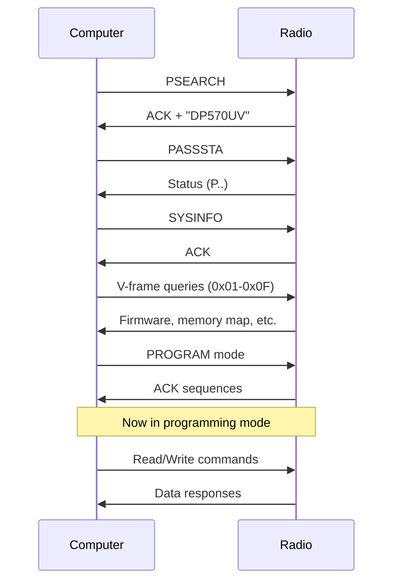

# DM-32UV Protocol Overview

## Architecture

The DM-32UV radio uses a **proprietary serial protocol** for reading and writing configuration data.

```
┌──────────────┐         Serial          ┌──────────────┐
│              │      (115200 8N1)       │              │
│   Computer   │  ◄───────────────────►  │   DM-32UV    │
│   (CPS/App)  │                         │    Radio     │
│              │                         │              │
└──────────────┘                         └──────────────┘
```

## Protocol Layers

### 1. Transport Layer
- **Serial Port**: 115200 baud, 8N1, no flow control
- **Timeout**: 500ms for most commands
- **Framing**: No start/stop markers, fixed-length or length-prefixed messages

### 2. Session Layer
- **Handshake**: Three ASCII commands (PSEARCH, PASSSTA, SYSINFO)
- **Version Query**: V-frame commands to get firmware and memory layout
- **Programming Mode**: Must explicitly enter before memory access
- **State Machine**: Must follow exact sequence

### 3. Application Layer
- **Memory Read**: Random-access 4KB block reads
- **Memory Write**: 4KB block writes with metadata
- **Configuration**: Register-based settings (208 registers)
- **Metadata**: Dynamic memory map discovery

## Communication Flow



## Command Types

### Handshake Commands (ASCII)
- **PSEARCH**: Identify radio model
- **PASSSTA**: Get radio status
- **SYSINFO**: Request system info

### V-Frame Commands (Binary)
- **Format**: `56 00 00 00 <ID>`
- **Purpose**: Query firmware version, memory layout, capabilities
- **Response**: `56 <ID> <len> <data[len]>`

### Programming Mode Commands
- **PROGRAM**: Enter programming mode
- **Mode 02**: Set programming mode
- **ACK 06**: Confirm ready

### Memory Access Commands
- **Read (0x52)**: `52 <addr:3> <len:2>` → `57 <addr:3> <len:2> <data>`
- **Write (0x57)**: `57 <addr:3> 00 10 <data:4096> <metadata:1>` → `06` (ACK)

## Memory Organization

```
┌─────────────────────────────────────────┐
│       16MB Address Space                │
├─────────────────────────────────────────┤
│ 0x000000 - 0x000FFF                     │
│   Low memory (4KB)                      │
│   System config                         │
├─────────────────────────────────────────┤
│ 0x001000 - 0x0C8FFF                     │
│   Main config block (800KB)             │
│   - Channels (48 blocks × 4KB)          │
│   - Zones, scan lists, messages         │
├─────────────────────────────────────────┤
│ 0x180000 - 0x200FFF                     │
│   Unknown/Reserved (512KB)              │
├─────────────────────────────────────────┤
│ 0x278000 - 0xFFFFFF                     │
│   DMR contacts (4-13MB, varies)         │
└─────────────────────────────────────────┘
```

## Data Discovery Mechanism

The protocol uses **dynamic discovery** instead of hardcoded addresses:

1. **V-frame 0x0A** returns main config block range (0x001000 - 0x0C8FFF)
2. **Metadata search**: Read last byte of each 4KB block to determine type
3. **Build lookup table**: Map metadata values to addresses
4. **Read in order**: Use metadata to determine read sequence

### Metadata Values
- `0x12-0x41`: Channel blocks (48 blocks)
- `0x11`: Zones
- `0x0F`: RX groups
- `0x0A`: Canned messages
- `0x06`: Scan lists
- `0x00`: Empty block
- `0xFF`: Invalid block

## Channel Data

### Capacity
- **Max channels**: 4,000
- **Channel blocks**: 48 (metadata 0x12-0x41)
- **Channels per block**: ~85 (4096 bytes / 48 bytes)
- **Channel size**: 48 bytes

### Channel Structure
```
┌────────────────┬──────────┐
│ Name (16 bytes)│ ASCII    │
├────────────────┼──────────┤
│ RX Freq (4)    │ BCD      │
├────────────────┼──────────┤
│ TX Freq (4)    │ BCD      │
├────────────────┼──────────┤
│ Flags (24)     │ Binary   │
└────────────────┴──────────┘
Total: 48 bytes
```

## Encoding Schemes

### BCD (Binary Coded Decimal)
- **Frequencies**: 4 bytes, reversed byte order
- **Example**: 145.350 MHz = `00 50 53 14`

### CTCSS/DCS
- **Size**: 2 bytes
- **CTCSS**: `<tone_low> <tone_high>` (e.g., 127.3 Hz = `73 12`)
- **DCS**: High byte ≥ 0x80 (e.g., D023N = `23 80`)

### Flags
- **Power**: Bits in byte 28
- **Mode**: Bits in byte 24
- **DMR settings**: Color code, time slot (byte 32)

## Critical Requirements

1. ✅ **Command order must be exact** - No skipping steps
2. ✅ **Timing matters** - 5-25ms delays between commands
3. ✅ **Little-endian** - All multi-byte values including read addresses
4. ✅ **4KB alignment** - All memory addresses must be 4KB-aligned
5. ✅ **Metadata required** - Must search for block types, not assume addresses
6. ✅ **Channel count in header** - First 4 bytes of first channel block (metadata 0x12)
7. ✅ **Channel offsets** - First block starts at 0x10, subsequent at 0x00

## Error Handling

- **Timeouts**: 500ms for most operations, 5000ms for writes
- **Invalid responses**: NAK (0x15) or wrong ACK values
- **Programming mode**: Can re-enter if connection lost
- **Checksums**: Not used - rely on serial port integrity

---
