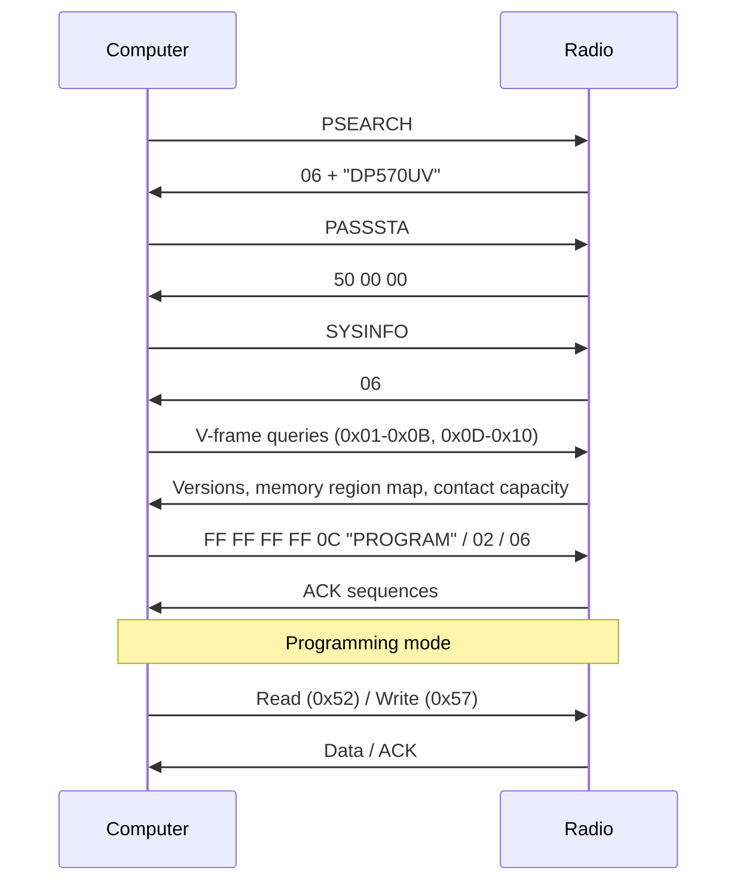

# DM-32UV Protocol Overview

This is the entry point to the spec. It summarises the protocol at a glance; every section links to
the document that owns the detail.

## Reference implementation and evidence

These documents are validated against **[neonplug](https://neonplug.app)** — a working browser-based
CPS (Web Serial API) that talks to real DM-32UV hardware. Protocol code:
`src/radios/dm32uv/` — `connection.ts` (wire layer), `protocol.ts` (read/write orchestration),
`memory.ts` (block discovery), `constants.ts` (limits, offsets, timings), `structures.ts`
(record parse/encode), `blockLayouts.ts` (hardware-verified offsets).

Above the implementation sit two OEM-CPS serial captures against a real radio — the top authority
for this repository:

| Capture | File | Radio | Firmware | CPS |
|---|---|---|---|---|
| Full read | [`serial_capture_example.txt`](serial_capture_example.txt) | DP570UV | `DM32.01.01.046` | DMR CPS V1.41 |
| Full write | [`serial_capture_write_example.txt`](serial_capture_write_example.txt) | same | same | same |

> ⚠️ **Sample bias.** The captured radio was at factory defaults (25 channels, 2 zones, 2 scan
> lists, …). Observed *entry counts* say nothing about maximum capacity; observed *strides* and the
> *logical-ID space* do.

### Confidence markers (used throughout the spec)

| Marker | Meaning |
|---|---|
| *(no marker)* | **CONFIRMED** — observed on real hardware, or implemented and exercised against a real radio |
| `⚠️ DERIVED` | Implemented or inferred, but never verified against hardware |
| `❓ UNKNOWN` | Purpose not established |

## Architecture

The DM-32UV uses a proprietary serial protocol for reading and writing configuration data.

```
┌──────────────┐         Serial          ┌──────────────┐
│              │      (115200 8N1)       │              │
│   Computer   │  ◄───────────────────►  │   DM-32UV    │
│   (CPS/App)  │                         │    Radio     │
│              │                         │              │
└──────────────┘                         └──────────────┘
```

### Supported models

`PSEARCH` answers with `0x06` followed by a 7-character ASCII model string. Both captures — taken
from a radio sold as a **Baofeng DM-32UV** — answer **`DP570UV`**, so DM-32UV hardware evidently
reports the DP570UV model string. The reference implementation accepts any model string containing
`DP570`, `DM32` or `DM-32`, so other rebadges may also work.

### Protocol layers

1. **Transport** — 115200 baud (8N1 / no flow control are the host defaults; nothing else is ever
   set). No framing bytes, no checksum: integrity rests on magic bytes, echoed IDs, length fields
   and the 1-byte write ACK. Timeouts: 5 s per request/response, 15 s for a 4 KB read payload.
2. **Session** — ASCII handshake (`PSEARCH` / `PASSSTA` / `SYSINFO`), V-frame queries (versions and
   memory-region map), then an explicit programming-mode entry sequence. There is **no exit
   command** — closing the port (DTR reset) is what takes the radio out of programming mode.
3. **Application** — random-access reads (1 byte to 4 KB), 4 KB block writes, and dynamic
   memory-map discovery via the logical-block-ID byte (below).

### Communication flow


```mermaid
sequenceDiagram
    participant C as Computer
    participant R as Radio

    C->>R: PSEARCH
    R->>C: 06 + "DP570UV"

    C->>R: PASSSTA
    R->>C: 50 00 00

    C->>R: SYSINFO
    R->>C: 06

    C->>R: V-frame queries (0x01-0x0B, 0x0D-0x10)
    R->>C: Versions, memory region map, contact capacity

    C->>R: FF FF FF FF 0C "PROGRAM" / 02 / 06
    R->>C: ACK sequences

    Note over C,R: Programming mode

    C->>R: Read (0x52) / Write (0x57)
    R->>C: Data / ACK
```

### Command summary

Full frame-level reference with hex examples: **[03-COMMANDS.md](03-COMMANDS.md)**.
Exact sequencing and timing: **[02-CONNECTION-SEQUENCE.md](02-CONNECTION-SEQUENCE.md)**.

| Command | Frame | Response |
|---|---|---|
| Handshake | ASCII `PSEARCH`, `PASSSTA`, `SYSINFO` | `06`+model / `50 00 00` / `06` |
| V-frame query | `56 00 00 <hint> <id>` (5 B) | `56 <id> <len> <payload…>` — len is one byte, so ≤ 255 B |
| Enter programming mode | `FF FF FF FF 0C "PROGRAM"` → `02` → `06` | `06` → 8×`FF` → `06` |
| Read | `52 <addr:3 LE> <len:2 LE>` | `57` + echoed header + data (payload at offset 6) |
| Write | `57 <addr:3 LE> 00 10 <data:4096>` — **4102 bytes total** | `06` ACK. The block's logical-ID byte travels *inside* the payload at offset `0xFFF` |

There are no retries and no checksums; a failed write aborts the operation.

## Memory organization

The address space is **24-bit** (3-byte little-endian addresses, `0x000000`–`0xFFFFFF` = 16 MB).
Region boundaries are reported at runtime by V-frames, each returning two little-endian `uint32`s
(`start`, `end`; `end` is the region's **last byte**). Decoded from the read capture:

```
┌─────────────────────────────────────────┐
│       16MB Address Space (24-bit)       │
├─────────────────────────────────────────┤
│ 0x001000 - 0x0C8FFF   (V-frame 0x0A)    │
│   Main config region (800 KiB)          │
│   200 x 4KB pages, logical-ID tagged    │
├─────────────────────────────────────────┤
│ 0x0C9000 - 0x149FFF   (V-frame 0x07)  ❓ │
├─────────────────────────────────────────┤
│ 0x150000 - 0x175FFF   (V-frame 0x0E)    │
│   Boot / startup image (152 KiB)        │
├─────────────────────────────────────────┤
│ 0x180000 - 0x200FFF   (V-frame 0x08)  ❓ │
├─────────────────────────────────────────┤
│ 0x201000 - 0x264FFF   (V-frame 0x06)  ❓ │
├─────────────────────────────────────────┤
│ 0x278000 - 0x6DBFFF   (V-frame 0x0F)    │
│   DMR contacts (4.4 MiB, 92 B records)  │
├─────────────────────────────────────────┤
│ 0x6DC000 - 0xFFFFFF   (V-frame 0x09)  ❓ │
└─────────────────────────────────────────┘
```

The map is not contiguous — the gaps (`0x000000`–`0x000FFF`, `0x14A000`–`0x14FFFF`,
`0x176000`–`0x17FFFF`, `0x265000`–`0x277FFF`) are covered by no V-frame and are `❓ UNKNOWN`.
Full V-frame table, raw payloads and per-region notes: **[04-MEMORY-LAYOUT.md](04-MEMORY-LAYOUT.md)**.

### The metadata byte is a logical block ID

**This is the single most important thing to understand about DM-32UV memory.** The last byte of
each 4 KB page in the main config region (`+0xFFF`) is a **logical block identifier**, not a block
"type":

- Across all 200 pages, **every non-empty value occurs exactly once**. `0x12` is not "a channel
  block" — it is *channel bank slot 1*; `0x13` is slot 2, and so on.
- Physical addresses are assigned by what behaves like a **flash translation layer**. They differ
  between radios and move as the codeplug is edited. **Never hardcode a page address** — always
  resolve IDs by scanning 1 byte at `+0xFFF` of every page.
- The OEM CPS walks the *entire* ID space on both read and write, substituting the sentinel address
  `0xFFF001` for IDs that currently have no physical page.

Headline ID ranges (the full census, including everything still unknown, is
**[07-BLOCK-INVENTORY.md](07-BLOCK-INVENTORY.md)**):

| ID / range | Contents |
|---|---|
| `0x12`–`0x41` | Channel bank, 48 slots (slot 1 carries the header + count; slot 48 also holds VFO A/B) |
| `0x42`, `0x43` | Per-channel TX contact (talk-group) index, 2 bytes per channel |
| `0x44`–`0x48` | Talk groups, 5 slots |
| `0x5C`–`0x64` | Zones, 9 slots |
| `0x11` / `0x0F` / `0x0A` / `0x67` | Scan lists / RX groups / quick messages / DMR radio IDs |
| `0x04` / `0x02` / `0x06` / `0x0B` | Radio settings / calibration (read-only) / analog config / talk-group index tables |
| `0x10` | Digital emergency + analog emergency + encryption keys (three sections, one page) |
| `0x00`, `0xFF` | Page tags, not IDs: `0x00` ⚠️ invalidated page, `0xFF` ⚠️ free page |

Of the 71 logical IDs allocated on the captured radio, **31 are never touched by the OEM CPS** in
either direction — those are the genuine unknowns, enumerated in
[07-BLOCK-INVENTORY.md](07-BLOCK-INVENTORY.md).

> Logical block IDs and V-frame IDs are **different namespaces** — block `0x0F` (RX groups) has
> nothing to do with V-frame `0x0F` (contact region). Collisions are coincidental.

## Capacity

As enforced by the reference implementation (`constants.ts` `LIMITS`):

| Item | Max | Notes |
|---|---|---|
| Channels | 4,000 | plus VFO A/B as logical channels 4001/4002. 48 bytes each; slot 1 holds 84 records, slots 2–48 hold 85 |
| Channels per zone | 64 | |
| Zones | 250 | 145-byte records across 9 zone slots |
| Scan lists | 32 | 57-byte records; 15 channels each `⚠️ DERIVED` |
| Talk groups | 800 | 24-byte records |
| DMR radio IDs | 250 | 16-byte records |
| Quick messages | 20 | 129-byte records |
| DMR RX groups | 32 | 109-byte records; limit from the header bitmask `⚠️ DERIVED` |
| Digital / analog emergency | 8 / 16 | block `0x10`; analog max is arithmetic `⚠️ DERIVED` |
| Encryption keys | 8 | block `0x10`, 44-byte records |
| DMR contacts | 50,000 | reported by V-frame `0x10`; 150,000 on L01 firmware `⚠️ DERIVED` |

Byte-level record layouts: **[05-DATA-STRUCTURES.md](05-DATA-STRUCTURES.md)**.
Encodings (BCD frequencies, CTCSS/DCS, strings, integers): **[06-ENCODING.md](06-ENCODING.md)**.

## Read / write workflow

Both flows share the same opening: handshake → V-frames → programming mode → logical-ID scan
(200 × 1-byte reads, ~12 s).

**Read**: scan IDs, read the channel count from block `0x12`, bulk-read the required 4 KB pages
150 ms apart, disconnect, parse everything from the cache. Contacts and the boot image are separate
operations against raw regions (V-frames `0x0F` / `0x0E`), each with its own connect cycle.

**Write**: page-selective — re-run discovery, regenerate only changed pages (channels, zones, scan
lists), re-stamp the logical ID at `data[0xFFF]`, write 150 ms apart, TX-contact blocks last.
Everything else (settings, talk groups, messages, emergency systems, …) is a separate single-block
read-modify-write entry point.

> ⚠️ **Preserve bytes you do not understand.** Regenerating a page from defaults destroys every
> `❓ UNKNOWN` byte and bit — and the captures prove many of them carry real data.
> Read-modify-write every page.

## Critical requirements

1. **Command order must be exact** — no skipping steps
2. **Timing matters** — see the [timing reference](02-CONNECTION-SEQUENCE.md#timing-and-timeout-reference)
3. **Little-endian** everywhere: 24-bit addresses, 16-bit lengths, all multi-byte values
4. **4 KB alignment** for block operations (byte-granular reads may be unaligned)
5. **Discovery required** — resolve logical block IDs to addresses at runtime; they move
6. **Channel count** — `uint16` LE at offset `0x00` of block `0x12` (2 bytes, not 4)
7. **Channel offsets** — slot 1 starts at `0x10` (84 records), later slots at `0x00` (85)
8. **Preserve the logical-ID byte** — any page written back must carry its ID at `data[0xFFF]`
9. **Preserve bytes you do not understand** — large parts of every block are still `❓ UNKNOWN`

## Error handling

- **Timeouts**: 5,000 ms per request/response cycle; 15,000 ms for a 4 KB read payload
- **Write ACK**: `0x06` — the only response byte ever captured (76/76 writes). The `0xC0`/`0xC8`/
  `0x48` error codes sometimes quoted are speculation from implementation comments, never observed;
  no NAK byte exists
- **Short reads** are accepted (the radio declares the length it returns); zero or over-length is an
  error
- **Retries**: none — recover with a full disconnect → 400 ms → reconnect cycle
- **Stuck radio**: if the radio was left in programming mode, close the port, wait ~400 ms, and
  reconnect; it will not answer `PSEARCH` until its DTR reset completes
