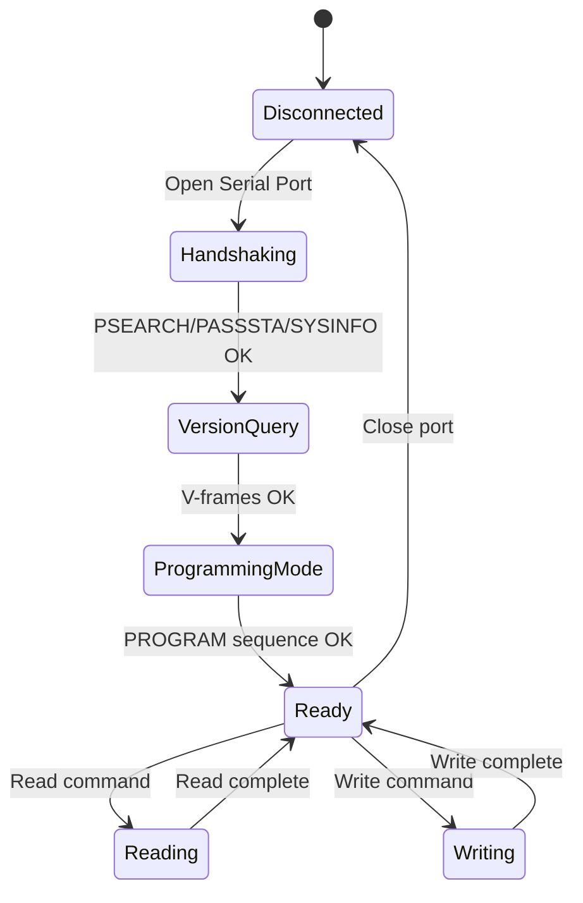

# DM-32UV Connection Sequence

## Complete Connection Flow

This document provides the **exact sequence** required to establish communication with the DM-32UV radio.

> **⚠️ CRITICAL**: Steps must be executed in this exact order. Skipping or reordering will cause connection failure.

## State Machine



## Step-by-Step Sequence

> **💡 Real Example**: See `serial_capture_example.txt` for a complete capture of this sequence from the official CPS software.

### Step 1: Open Serial Port

**Configuration:**
```
Port: /dev/tty.usbserial-XXXXX (varies by system)
Baud: 115200
Data Bits: 8
Parity: None
Stop Bits: 1
Flow Control: None
Timeout: 500ms
```

**Validation:**
- Port must exist and be accessible
- Radio must be powered ON
- USB cable must be connected

---

### Step 2: PSEARCH Command

**Purpose:** Identify radio model

**Command:** (ASCII string)
```
Send: 50 53 45 41 52 43 48
      P  S  E  A  R  C  H
```

**Expected Response:** (8 bytes)
```
Receive: 06 44 50 35 37 30 55 56
         ACK D  P  5  7  0  U  V

ACK (0x06) + "DP570UV" (7 bytes)
```

**Error Handling:**
- No response → Radio not connected / not powered
- Wrong response → Wrong radio model
- Timeout → Increase timeout to 1000ms and retry

**Implementation Notes:**
- Send ASCII string "PSEARCH" (7 bytes)
- Read exactly 8 bytes (ACK + model string)
- Validate first byte is 0x06 (ACK)
- Validate model string matches "DP570UV"

**Serial Capture Reference:** See lines 3-5 in `serial_capture_example.txt`

---

### Step 3: PASSSTA Command

**Purpose:** Get radio status

**Command:** (ASCII string)
```
Send: 50 41 53 53 53 54 41
      P  A  S  S  S  T  A
```

**Expected Response:** (3 bytes, varies by radio)
```
Option 1: 50 00 00
          P  .  .

Option 2: 50 FF FF
          P  .  .
```

**Notes:**
- Response varies between radios but doesn't affect functionality
- Both `50 00 00` and `50 FF FF` are valid
- First byte should always be `50` ('P')

**Implementation Notes:**
- Send ASCII string "PASSSTA" (7 bytes)
- Read exactly 3 bytes
- Validate first byte is 0x50 ('P')
- Status bytes (bytes 1-2) may vary but don't affect functionality

**Serial Capture Reference:** See lines 6-8 in `serial_capture_example.txt`

---

### Step 4: SYSINFO Command

**Purpose:** Request system information

**Command:** (ASCII string)
```
Send: 53 59 53 49 4E 46 4F
      S  Y  S  I  N  F  O
```

**Expected Response:** (1 byte)
```
Receive: 06
         ACK
```

**Implementation Notes:**
- Send ASCII string "SYSINFO" (7 bytes)
- Read exactly 1 byte
- Validate response is 0x06 (ACK)

**Serial Capture Reference:** See lines 9-11 in `serial_capture_example.txt`

---

### Step 5: V-Frame Queries

**Purpose:** Get firmware version and memory layout

#### V-Frame Format

**Command:**
```
Byte 0: 0x56 ('V')
Bytes 1-3: 0x00 0x00 0x00
Byte 4: Frame ID (0x01-0x0F)
```

**Response:**
```
Byte 0: 0x56 ('V')
Byte 1: Frame ID (echoed)
Byte 2: Data length
Bytes 3+: Data (length bytes)
```

#### Required V-Frames

**V-Frame 0x01: Firmware Version**
```
Send: 56 00 00 00 01
Receive: 56 01 0E 44 4D 33 32 2E 30 31 2E 30 31 2E 30 34 30
         V  ID LEN D  M  3  2  .  0  1  .  0  1  .  0  4  0

Parse: "DM32.01.01.040" (14 bytes)
```

**V-Frame 0x03: Build Date**
```
Send: 56 00 00 00 03
Receive: 56 03 0A 32 30 32 32 2D 30 36 2D 32 37
         V  ID LEN 2  0  2  2  -  0  6  -  2  7

Parse: "2022-06-27" (10 bytes)
```

**V-Frame 0x0A: Main Config Block** (CRITICAL)
```
Send: 56 00 00 00 0A
Receive: 56 0A 08 00 10 00 00 FF 8F 0C 00
         V  ID LEN [start addr] [end addr]

Parse:
  Start address: 00 10 00 00 (little-endian) = 0x001000
  End address:   FF 8F 0C 00 (little-endian) = 0x0C8FFF
  Size: 0x0C8FFF - 0x001000 + 1 = 819,200 bytes (800 KB)
```

**Other Useful V-Frames:**
- `0x04`: DSP version
- `0x05`: Radio version
- `0x0B`: Code plug version
- `0x08`: Zones memory range
- `0x0F`: DMR contacts memory range

**Implementation Notes:**
- Send: `56 00 00 00 <frame_id>` (5 bytes)
- Read header: 3 bytes (0x56, frame_id, length)
- Validate header matches request
- Read data: `length` bytes
- Parse data according to frame type (see V-Frame Reference Table)

**Serial Capture Reference:** See lines 12-67 in `serial_capture_example.txt` for all V-frame queries

---

### Step 6: Enter Programming Mode

**Purpose:** Enable memory read/write access

This is a **three-step sequence** that must succeed completely:

#### Step 6a: PROGRAM Command

**Command:**
```
Bytes 0-4: 0xFF 0xFF 0xFF 0xFF 0x0C
Bytes 5-11: 50 52 4F 47 52 41 4D
            P  R  O  G  R  A  M

Total: FF FF FF FF 0C 50 52 4F 47 52 41 4D (12 bytes)
```

**Expected Response:**
```
Receive: 06 (ACK)
```

#### Step 6b: Mode 02 Command

**Command:**
```
Send: 02 (1 byte)
```

**Expected Response:**
```
Receive: FF FF FF FF FF FF FF FF (8 bytes of 0xFF)
```

#### Step 6c: ACK 06 Command

**Command:**
```
Send: 06 (1 byte)
```

**Expected Response:**
```
Receive: 06 (ACK)
```

**Implementation Notes:**
- **Step 6a**: Send `FF FF FF FF 0C` + "PROGRAM" (12 bytes), expect 0x06 (ACK)
- **Step 6b**: Send 0x02 (1 byte), expect 8 bytes of 0xFF
- **Step 6c**: Send 0x06 (1 byte), expect 0x06 (ACK)
- All three steps must complete successfully
- Radio is now in programming mode and accepts read/write commands

**Serial Capture Reference:** See lines 74-82 in `serial_capture_example.txt` for programming mode entry

---

### Step 7: Ready State

After completing all steps, the radio is in **programming mode** and ready to accept:
- Memory read commands (`0x52`)
- Memory write commands (`0x57`)

**Timing Notes:**
- Add 10ms delay between commands: `time.sleep(0.01)`
- Use 500ms timeout for most operations
- Use 5000ms timeout for write operations

---

**Note**: This is the required sequence. All steps must complete successfully before the radio will accept memory read/write commands.

---

## Complete Workflow Example

Here's a complete workflow showing connection through channel reading:

### Workflow: Read All Channels from Radio

```python
import serial
import time
import struct

def connect_and_read_channels():
    """Complete workflow: Connect to radio and read all channels"""
    
    # Step 1: Open serial port
    port = serial.Serial('/dev/ttyUSB0', 115200, timeout=0.5)
    time.sleep(0.1)  # Brief delay after opening
    
    # Step 2-4: Handshake
    port.write(b'PSEARCH')
    if port.read(8) != b'\x06DP570UV':
        raise IOError("Radio not found")
    time.sleep(0.01)
    
    port.write(b'PASSSTA')
    port.read(3)  # Status (varies, ignore)
    time.sleep(0.01)
    
    port.write(b'SYSINFO')
    if port.read(1) != b'\x06':
        raise IOError("SYSINFO failed")
    time.sleep(0.01)
    
    # Step 5: Query V-frames
    # Get firmware version
    port.write(b'\x56\x00\x00\x00\x01')
    response = port.read(3)
    length = response[2]
    firmware = port.read(length).decode('ascii')
    print(f"Firmware: {firmware}")
    time.sleep(0.01)
    
    # Get main config block range
    port.write(b'\x56\x00\x00\x00\x0A')
    response = port.read(11)
    start_addr = struct.unpack('<I', response[3:7])[0]
    end_addr = struct.unpack('<I', response[7:11])[0]
    print(f"Main config: 0x{start_addr:06X} - 0x{end_addr:06X}")
    time.sleep(0.01)
    
    # Step 6: Enter programming mode
    port.write(b'\xFF\xFF\xFF\xFF\x0CPROGRAM')
    if port.read(1) != b'\x06':
        raise IOError("PROGRAM failed")
    time.sleep(0.01)
    
    port.write(b'\x02')
    if port.read(8) != b'\xFF' * 8:
        raise IOError("Mode 02 failed")
    time.sleep(0.01)
    
    port.write(b'\x06')
    if port.read(1) != b'\x06':
        raise IOError("ACK failed")
    time.sleep(0.01)
    
    print("Programming mode active")
    
    # Step 7: Discover channel blocks via metadata
    channel_blocks = []
    for addr in range(start_addr, end_addr + 1, 0x1000):
        # Read metadata byte at offset 0xFFF
        metadata_addr = addr + 0xFFF
        cmd = b'\x52' + struct.pack('<I', metadata_addr)[:3] + b'\x01\x00'
        port.write(cmd)
        response = port.read(7)
        metadata = response[6]
        
        # Check if this is a channel block (0x12-0x41)
        if 0x12 <= metadata <= 0x41:
            channel_blocks.append((addr, metadata))
            print(f"Channel block: 0x{addr:06X} (metadata 0x{metadata:02X})")
        
        time.sleep(0.005)  # 5ms between metadata reads
    
    # Step 8: Read first channel block to get channel count
    if not channel_blocks:
        raise ValueError("No channel blocks found")
    
    first_block_addr = channel_blocks[0][0]
    cmd = b'\x52' + struct.pack('<I', first_block_addr)[:3] + b'\x00\x10'
    port.write(cmd)
    response = port.read(6)  # Header
    block_data = port.read(4096)
    time.sleep(0.025)  # 25ms after block read
    
    # Parse channel count from first 4 bytes
    channel_count = struct.unpack('<I', block_data[0:4])[0]
    print(f"Total channels: {channel_count}")
    
    # Step 9: Parse channels from first block (starting at offset 0x10)
    channels = []
    offset = 0x10
    for i in range(min(channel_count, 85)):  # Max 85 channels in first block
        channel_data = block_data[offset:offset+48]
        # Parse channel name (first 16 bytes)
        name = channel_data[0:16].split(b'\x00')[0].decode('ascii', errors='ignore')
        if name:
            channels.append({'number': i+1, 'name': name})
        offset += 48
    
    # Step 10: Read remaining channel blocks if needed
    for block_addr, metadata in channel_blocks[1:]:
        if len(channels) >= channel_count:
            break
        
        cmd = b'\x52' + struct.pack('<I', block_addr)[:3] + b'\x00\x10'
        port.write(cmd)
        response = port.read(6)
        block_data = port.read(4096)
        time.sleep(0.025)
        
        # Parse channels (starting at offset 0x00 for non-first blocks)
        offset = 0x00
        for i in range(85):  # Max 85 channels per block
            if len(channels) >= channel_count:
                break
            channel_data = block_data[offset:offset+48]
            name = channel_data[0:16].split(b'\x00')[0].decode('ascii', errors='ignore')
            if name:
                channels.append({'number': len(channels)+1, 'name': name})
            offset += 48
    
    port.close()
    return channels

# Run the workflow
channels = connect_and_read_channels()
for ch in channels[:10]:  # Print first 10 channels
    print(f"Channel {ch['number']}: {ch['name']}")
```

This example demonstrates:
1. Complete connection sequence
2. V-frame queries for firmware and memory layout
3. Programming mode entry
4. Metadata discovery to find channel blocks
5. Reading and parsing channel data
6. Proper timing and error handling
