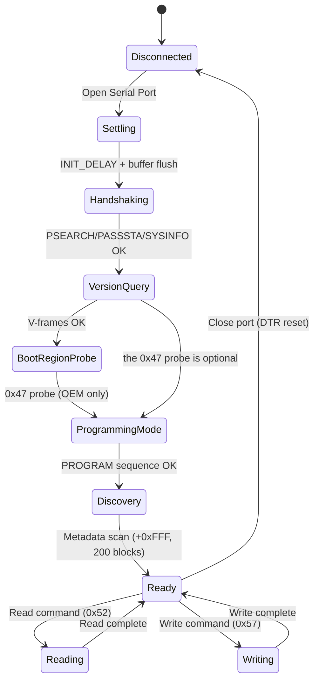

# DM-32UV Connection Sequence

## Complete Connection Flow

This document provides the **exact sequence** required to establish communication with the DM-32UV radio.

> **⚠️ CRITICAL**: Steps must be executed in this exact order. Skipping or reordering will cause connection failure.

### Sources and confidence

Everything in this document is cross-checked against the sources below. Note that the two captures are **not** fully independent of each other — same radio, same firmware, same CPS build, consecutive sessions — so agreement between them proves reproducibility, not generality across radios:

| Source | What it proves |
|---|---|
| `serial_capture_example.txt` (OEM CPS **read**, DMR CPS V1.41, firmware `DM32.01.01.046`) | What the official CPS and a real radio actually put on the wire |
| `serial_capture_write_example.txt` (OEM CPS **write**, same radio/firmware) | The write path, and the handshake repeated identically |
| **neonplug** — `src/radios/dm32uv/connection.ts`, `protocol.ts`, `constants.ts` | A working third-party implementation, including tuned delays that the capture cannot show (the capture logs no inter-command timings) |

Confidence markers used below:

| Marker | Meaning |
|---|---|
| *(no marker)* | CONFIRMED — present in a hardware capture and/or in the shipping neonplug connect path |
| `⚠️ DERIVED` | Implemented but not verified against hardware, or asserted only by a code comment |
| `❓ UNKNOWN` | Purpose not established |

> **Where the capture and neonplug disagree, the capture wins** — but both behaviours are recorded, because neonplug's delays are an *implementation* fact and the capture is a *protocol* fact.

**Implementation reference:** `src/radios/dm32uv/connection.ts`, `src/radios/dm32uv/protocol.ts`, `src/radios/dm32uv/constants.ts` (neonplug)

## State Machine


```mermaid
stateDiagram-v2
    [*] --> Disconnected
    Disconnected --> Settling: Open Serial Port
    Settling --> Handshaking: INIT_DELAY + buffer flush
    Handshaking --> VersionQuery: PSEARCH/PASSSTA/SYSINFO OK
    VersionQuery --> BootRegionProbe: V-frames OK
    BootRegionProbe --> ProgrammingMode: 0x47 probe (OEM only)
    VersionQuery --> ProgrammingMode: the 0x47 probe is optional
    ProgrammingMode --> Discovery: PROGRAM sequence OK
    Discovery --> Ready: Metadata scan (+0xFFF, 200 blocks)
    Ready --> Reading: Read command (0x52)
    Ready --> Writing: Write command (0x57)
    Reading --> Ready: Read complete
    Writing --> Ready: Write complete
    Ready --> Disconnected: Close port (DTR reset)
```

## Step-by-Step Sequence

> **💡 Real Example**: See `serial_capture_example.txt` for a complete capture of this sequence from the official CPS software. Line numbers cited below refer to that file.

### Step 1: Open Serial Port

**Configuration:**
```
Port: /dev/tty.usbserial-XXXXX (varies by system)
Baud: 115200
Data Bits: 8
Parity: None
Stop Bits: 1
Flow Control: None
```

| Parameter | Value | Notes |
|---|---|---|
| Baud rate | `115200` | The only line parameter neonplug ever sets: `port.open({ baudRate: 115200 })` |
| Data bits / parity / stop bits / flow control | 8 / none / 1 / none | **Never explicitly set by neonplug** — these are the Web Serial defaults, which happen to be 8N1 with no flow control. Treat 8N1 as CONFIRMED-by-default, not as an asserted protocol requirement |
| Port-open timeout | `5000 ms` | Applied as a race around `port.open()` |

> *Previously documented as `Timeout: 500ms` — incorrect; the real values are in the [Timing and Timeout Reference](#timing-and-timeout-reference).*

**Validation:**
- Port must exist and be accessible
- Radio must be powered ON
- USB cable must be connected

---

### Step 1b: Post-Open Settling (REQUIRED — omitted from earlier versions of this doc)

The OEM capture cannot show this (a serial log records bytes, not silence), but neonplug found it experimentally and it is **required in practice** — the shipping connect path will not work without it.

The *explanation* neonplug gives is `⚠️ DERIVED`: its comments say the radio emits initialisation bytes after the port opens and will not answer `PSEARCH` until it has settled. **Neither capture corroborates the init bytes** — both go `Open port` → `PSEARCH` with no logged inbound data in between. So it is established that ~800 ms of quiet is needed, and *not* established that stray init bytes are why.

| # | Action | Duration | neonplug rationale (verbatim comment) |
|---|---|---|---|
| 1 | Delay `INIT_DELAY` | **400 ms** | *"Wait for radio to initialize after port open, then flush any init bytes."* Constant comment: *"ms after port open (increased for DM32.01.01.049 and similar)"* |
| 2 | `clearBuffer()` — cancel the reader, drop the buffer, wait `CLEAR_BUFFER_DELAY`, acquire a **fresh** reader | **200 ms** | See below |
| 3 | Delay `CLEAR_BUFFER_DELAY` again | **200 ms** | *"Additional settling time — radio needs this before it will respond to PSEARCH."* |

Total quiet time between port open and the first `PSEARCH` byte: **~800 ms**.

**Why cancel-and-reacquire rather than a read timeout** (verbatim from `connection.ts`):

> *"Uses cancel + reacquire on the reader rather than a Promise.race timeout. The race approach leaves a "ghost" reader.read() in flight when the timeout fires before init bytes arrive; that ghost read later consumes the PSEARCH response, causing a first-connection failure that looks fine on retry. By cancelling the reader we abort any in-flight read, release the stream lock, and let incoming init bytes be received by the OS and discarded while we wait (CLEAR_BUFFER_DELAY). A fresh reader is then acquired with a clean slate before the handshake begins."*

If the port was previously open, or was closed by a prior `disconnect()`, an additional `REOPEN_DELAY` = **400 ms** applies *before* re-opening — see [Disconnect and Reconnect](#disconnect-and-reconnect).

**Implementation reference:** `src/radios/dm32uv/connection.ts`

---

### Step 2: PSEARCH Command

**Purpose:** Identify radio model

**Command:** (ASCII string)
```
Send: 50 53 45 41 52 43 48
      P  S  E  A  R  C  H
```

**Expected Response:** (8 bytes)
```
Receive: 06 44 50 35 37 30 55 56
         ACK D  P  5  7  0  U  V

ACK (0x06) + "DP570UV" (7 bytes)
```

**Timing:** send the 7 ASCII bytes, then wait `PSEARCH_READ_DELAY` = **150 ms** before reading. (`sendCommand()` also delays 10 ms after the write, so the real gap is ~160 ms.) Constant comment: *"ms after PSEARCH before reading response (radio needs time to reply)"*.

**Error Handling:**
- No response → Radio not connected / not powered / still in programming mode from a previous session (see [Disconnect and Reconnect](#disconnect-and-reconnect))
- Wrong response → Wrong radio model
- Timeout with **0 bytes received** → neonplug replaces the raw error with `No reply from the radio. Is the radio connected and turned on?`
- Timeout with **partial bytes** → the received hex is surfaced verbatim as `PSEARCH handshake failed: …`

> There is no retry logic anywhere in the protocol. If `PSEARCH` times out, the fix is the 150 ms pre-read delay and/or the 400 ms reopen delay — not a longer timeout (it is already 5000 ms).

**Implementation Notes:**
- Send ASCII string "PSEARCH" (7 bytes) — no terminator, no length prefix, no framing
- Wait 150 ms
- Read exactly 8 bytes (ACK + model string) with the 5000 ms default timeout
- Validate first byte is 0x06 (ACK)
- Decode bytes 1-7 as ASCII, strip NULs, trim
- **Model acceptance is substring-based, not an exact match**: neonplug accepts a model string containing `DP570`, `DM32`, **or** `DM-32`. The capture radio is a **DP570UV** — a DM-32UV clone — and returns exactly `DP570UV`

**Serial Capture Reference:** lines **26-28** in `serial_capture_example.txt` (TX at 26, RX at 28)

---

### Step 3: PASSSTA Command

**Purpose:** Get radio status

**Command:** (ASCII string)
```
Send: 50 41 53 53 53 54 41
      P  A  S  S  S  T  A
```

**Expected Response:** (3 bytes)
```
Observed on hardware: 50 00 00
                      P  .  .
```

**Notes:**
- First byte is always `50` ('P') — this is the only byte any implementation validates
- **Bytes 1-2: ❓ UNKNOWN.** Both captures return `00 00`. neonplug reads and discards them.
  (`50 FF FF` is reported anecdotally for some radios but has never been evidenced)
- The name suggests a password-status query, but nothing confirms that — the response is never used to gate anything

**Timing:** neonplug delays **50 ms** after `PSEARCH` validation, sends `PASSSTA`, delays **50 ms**, then reads.

**Implementation Notes:**
- Send ASCII string "PASSSTA" (7 bytes)
- Read exactly 3 bytes
- Validate first byte is 0x50 ('P') → else `PASSSTA failed: Expected 0x50, got 0x..`
- Status bytes (bytes 1-2) may be discarded

**Serial Capture Reference:** lines **30-32** in `serial_capture_example.txt`

---

### Step 4: SYSINFO Command

**Purpose:** Request system information

**Command:** (ASCII string)
```
Send: 53 59 53 49 4E 46 4F
      S  Y  S  I  N  F  O
```

**Expected Response:** (1 byte)
```
Receive: 06
         ACK
```

**Timing:** **50 ms** before sending, **50 ms** after sending, then read 1 byte. After validation, **10 ms** — the handshake is complete.

**Implementation Notes:**
- Send ASCII string "SYSINFO" (7 bytes)
- Read exactly 1 byte
- Validate response is 0x06 (ACK) → else `SYSINFO failed: Expected 0x06, got 0x..`
- Despite the name, **no system information is returned** — the reply is a bare ACK. ❓ UNKNOWN what state, if any, this command changes on the radio; it is simply required

**Serial Capture Reference:** lines **34-36** in `serial_capture_example.txt`

---

### Step 5: V-Frame Queries

**Purpose:** Get firmware version, memory ranges, and the contact capacity

#### V-Frame Format

**Command — always 5 bytes:**
```
Byte 0: 0x56 ('V')
Bytes 1-2: 0x00 0x00          <- always zero in every observed request; purpose UNKNOWN
Byte 3: Length hint           <- 0x00 in every request except the OEM's first 0x0D probe (DERIVED)
Byte 4: Frame ID (0x01-0x10)
```

Marker key for the block above: bytes 1-2 are `❓ UNKNOWN` (observed constant, never varied); byte 3 is `⚠️ DERIVED` (see the correction note immediately below).

> **Previously documented as "Bytes 1-3: 0x00 0x00 0x00" and "Frame ID (0x01-0x0F)".** Two corrections from the capture:
> - **Byte 3 is not always zero.** The OEM CPS's *first* V-frame query is `56 00 00 40 0D` — byte 3 = `0x40`, and the radio returns exactly `0x40` = 64 payload bytes. The same frame queried with byte 3 = `0x00` (`56 00 00 00 0D`) returns **0 bytes**. Byte 3 therefore behaves as a **requested-payload-length hint**. `⚠️ DERIVED` — one frame, one value; no other frame is ever queried with a non-zero hint. neonplug always sends `0x00` and consequently always gets an empty `0x0D`.
> - **Frame IDs run to `0x10`**, not `0x0F`. `0x10` (max contact count) is queried by both the OEM CPS and neonplug.

**Response:**
```
Byte 0: 0x56 ('V')
Byte 1: Frame ID (echoed)
Byte 2: Data length (single unsigned byte → payload can never exceed 255)
Bytes 3+: Data (length bytes)
```

A length byte of `0` means "no payload"; no further bytes follow. Byte 0 or byte 1 mismatching the request is a hard error.

#### Query Order

Both the OEM CPS and neonplug query V-frames **immediately after `SYSINFO` and before entering programming mode**.

**OEM CPS order (from the capture, identical in the read and write captures):**

```
0x0D (with length hint 0x40)   ← first, and unique to the OEM
0x01 0x02 0x03 0x04 0x05 0x06 0x07 0x08 0x09 0x0A 0x0B
0x0D (plain — returns 0 bytes)
0x0E 0x0F 0x10
```

**neonplug order (`connection.ts`, literal array):**

```
0x01 0x02 0x03 0x04 0x05 0x06 0x07 0x08 0x09 0x0A 0x0B 0x0D 0x0E 0x0F 0x10
```

Notes on the two orders:

- **`0x0C` is never queried by anybody.** The OEM CPS skips it and so does neonplug (whose comment above the array still misleadingly says *"Query all V-frames (0x01 through 0x10)"*). ❓ UNKNOWN whether `0x0C` even exists.
- **neonplug omits the `0x40`-hinted `0x0D` probe** that the OEM issues first. That 64-byte payload is therefore never seen by neonplug. See the table below.
- A failing frame is logged and skipped by neonplug; the loop continues. Only `0x0A` is fatal if missing.
- Each query is separated by **50 ms** before the header read and **50 ms** after the payload (the trailing 50 ms is skipped when the payload length is 0). Both reads use the 5000 ms default timeout.

#### V-Frame Reference (payloads observed on hardware)

| ID | Meaning | Observed response | Confidence |
|---|---|---|---|
| `0x01` | Firmware version | `56 01 0E` + `"DM32.01.01.046"` | |
| `0x02` | ❓ UNKNOWN | `56 02 0C 00 00 00 00 00 00 15 A4 00 00 15 A4` — two repeated `0xA415` words | ❓ UNKNOWN — queried by both, consumed by neither |
| `0x03` | Build date | `56 03 0A` + `"2022-06-27"` | |
| `0x04` | DSP version | `56 04 0C` + `"D1.01.01.004"` | |
| `0x05` | Radio version | `56 05 0C` + `"R1.00.01.001"` | |
| `0x06` | Address range `0x201000–0x264FFF` — 409,600 B (400 KiB) | `56 06 08 00 10 20 00 FF 4F 26 00` | ❓ UNKNOWN what lives there — queried, never consumed |
| `0x07` | Address range `0x0C9000–0x149FFF` — 528,384 B (516 KiB) | `56 07 08 00 90 0C 00 FF 9F 14 00` | ❓ UNKNOWN — queried, never consumed |
| `0x08` | Address range `0x180000–0x200FFF` — 528,384 B (516 KiB) | `56 08 08 00 00 18 00 FF 0F 20 00` | ❓ UNKNOWN — **see correction below** |
| `0x09` | Address range `0x6DC000–0xFFFFFF` — 9,584,640 B (9360 KiB), i.e. up to the top of the 24-bit space | `56 09 08 00 C0 6D 00 FF FF FF 00` | ❓ UNKNOWN — queried, never consumed |
| `0x0A` | **Main config block range** `0x001000–0x0C8FFF` — 819,200 B (800 KiB) — **CRITICAL** | `56 0A 08 00 10 00 00 FF 8F 0C 00` | Required; missing/short → `Failed to get memory layout` |
| `0x0B` | Codeplug version | `56 0B 0C` + `"C1.00.01.001"` | |
| `0x0C` | — | **never queried** | ❓ UNKNOWN |
| `0x0D` | ❓ UNKNOWN — 64-byte blob starting `03 4E 2D 00` with a lone `0x3F` at payload offset `0x20`; every other byte is zero | `56 0D 40 03 4E 2D 00 …` (only when the request carries the `0x40` length hint); `56 0D 00` (empty payload) otherwise | ❓ UNKNOWN |
| `0x0E` | Address range `0x150000–0x175FFF` — 155,648 B (152 KiB, 38 × 4 KB) | `56 0E 08 00 00 15 00 FF 5F 17 00` | Range CONFIRMED; consumed as the **boot image base address** (`payload[0..3]`). (*Previously labelled "Memberships/RX Groups range" — a misnomer; see [04-MEMORY-LAYOUT.md](04-MEMORY-LAYOUT.md)*) |
| `0x0F` | **DMR contacts memory range** `0x278000–0x6DBFFF` — 4,603,904 B (4496 KiB) | `56 0F 08 00 80 27 00 FF BF 6D 00` | 4,603,904 B ÷ 92 B ≈ 50,042 entries, consistent with the 50,000 reported by `0x10` |
| `0x10` | **Max contact count** — little-endian integer | `56 10 03 50 C3 00` → `0x00C350` = **50000** | The payload is **3 bytes**, not 4 — see the note below |


> **`0x10` is 3 bytes, and the reference implementation mishandles it.** neonplug guards the parse with `length >= 4` and, failing that, re-queries `0x10` (getting 3 bytes again) before falling through to a hard-coded default of `50000`. Because the radio's own answer here *is* 50000, the bug is invisible on this firmware — but on any radio that answers with a 3-byte payload the V-frame value is never actually consumed. (No radio has been observed returning 4 bytes; whether any firmware does is ❓ UNKNOWN.) neonplug's user-facing `maxContacts` comes from the **firmware string** instead (`L01` → 150000, otherwise 50000), which its own comment calls *"more reliable than V-frame calculation"*. Parsers should read `0x10` as a little-endian integer over however many bytes the length byte reports.

> *`0x08` was previously labelled "Zones memory range" — incorrect (the label came from a commented-out neonplug line). Zones live inside the `0x0A` region at logical IDs `0x5C`–`0x64`; what `0x180000`–`0x200FFF` holds is `❓ UNKNOWN`.*

#### Decoding an address-pair payload

Frames `0x06`–`0x0A`, `0x0E` and `0x0F` all return **8 bytes = two little-endian uint32s**: `start_addr` then `end_addr`.

```
Send: 56 00 00 00 0A
Receive: 56 0A 08 00 10 00 00 FF 8F 0C 00
         V  ID LEN [start addr ] [end addr  ]

Parse:
  Start address: 00 10 00 00 (little-endian) = 0x001000
  End address:   FF 8F 0C 00 (little-endian) = 0x0C8FFF
  Size: 0x0C8FFF - 0x001000 + 1 = 819,200 bytes (800 KB)
```

`end_addr` is the **last byte of the last block**, not one-past-the-end. Block scanners must floor it to a 4 KB boundary:

```
alignedEnd = floor(end / 0x1000) * 0x1000
blockCount = (alignedEnd - start) / 0x1000 + 1
```

For `0x001000 … 0x0C8FFF` this yields **200 blocks** spanning `0x001000` to `0x0C8000` inclusive.

**Implementation Notes:**
- Send: `56 00 00 <len_hint> <frame_id>` (5 bytes); `len_hint` = `0x00` for everything except the OEM's initial `0x0D` probe
- Read header: 3 bytes (0x56, frame_id, length)
- Validate bytes 0 and 1 match the request
- If length is 0, stop — there is no payload
- Read data: `length` bytes
- Parse data according to frame type (table above)

**Serial Capture Reference:** lines **38-105** in `serial_capture_example.txt` (the `0x40`-hinted `0x0D` probe is at line 38; the `0x01` request is at line 46 and its reply at 48-49; the plain `0x0D` reply `56 0D 00` is at line 93; `0x10` responds at line 105). The same sequence appears at lines **16-83** of `serial_capture_write_example.txt`, byte-identical.

---

### Step 5b: `0x47` Region Probe — OEM CPS only, **not performed by neonplug**

**Purpose:** ❓ UNKNOWN. Both OEM captures issue exactly one `0x47` command between the last V-frame and `PROGRAM`.

**Command:** (6 bytes)
```
Send: 47 00 00 00 00 01
      G  [addr:3 LE ] [len:2 LE]
      → address 0x000000, length 0x0100 (256)
```

**Response:** (262 bytes = 6-byte echoed header + 256 bytes of payload)
```
Receive: 53 00 00 00 00 01 <256 bytes>
         S  [addr:3 LE ] [len:2 LE]
```

The framing is **identical in shape to the `0x52`/`0x57` read pair** — `0x47` ('G') requests, `0x53` ('S') answers, with a 24-bit LE address and a 16-bit LE length echoed back. It therefore looks like a read from a *different address space* (address `0x000000` is not part of the `0x0A` config range). ⚠️ DERIVED — the framing symmetry is obvious but nothing confirms what the space is.

The 256-byte payload observed on this radio is mostly `0xFF`, with a `0x36` followed by fifteen zero bytes at payload offset `0x40`, a lone `0x00` at `0x60`, and a dense run of bitfield-looking 16-bit values from roughly payload offset `0x70` to `0xBF`. Its meaning is ❓ UNKNOWN. It is byte-for-byte identical in the read and the write capture.

**Is it required?** **No.** neonplug never sends it and completes a full read and a full write successfully. The connection sequence works without it.

> A **5-byte** form of this frame (`47 00 01 00 00`) circulates in older notes — one byte short of
> the captured 6-byte frame. The capture is authoritative; use `47 00 00 00 00 01` if you
> implement this at all.

**Serial Capture Reference:** lines **107-125** in `serial_capture_example.txt`

---

### Step 6: Enter Programming Mode

**Purpose:** Enable memory read/write access

This is a **three-step sequence** that must succeed completely:

#### Step 6a: PROGRAM Command

**Command:**
```
Bytes 0-4: 0xFF 0xFF 0xFF 0xFF 0x0C
Bytes 5-11: 50 52 4F 47 52 41 4D
            P  R  O  G  R  A  M

Total: FF FF FF FF 0C 50 52 4F 47 52 41 4D (12 bytes)
```

**Expected Response:**
```
Receive: 06 (ACK)
```

#### Step 6b: Mode 02 Command

**Command:**
```
Send: 02 (1 byte)
```

**Expected Response:**
```
Receive: FF FF FF FF FF FF FF FF (8 bytes of 0xFF)
```

#### Step 6c: ACK 06 Command

**Command:**
```
Send: 06 (1 byte)
```

**Expected Response:**
```
Receive: 06 (ACK)
```

**Implementation Notes:**
- **Step 6a**: Send `FF FF FF FF 0C` + "PROGRAM" (12 bytes), expect 0x06 (ACK) → else `PROGRAM command failed`
- **Step 6b**: after **10 ms**, send 0x02 (1 byte), expect 8 bytes of 0xFF (`every(b => b === 0xFF)`) → else `Mode 02 failed`
- **Step 6c**: after **10 ms**, send 0x06 (1 byte), expect 0x06 (ACK) → else `ACK 06 failed`
- After a final **10 ms**, programming mode is active
- All three steps must complete successfully
- The `0x0C` byte in step 6a is ❓ **UNKNOWN**. It appears here and in the (dead) boot-image mode routine, and is never explained in any source
- The 8 bytes of `0xFF` in step 6b carry no observed information — they are `FF FF FF FF FF FF FF FF` in both captures. ❓ UNKNOWN whether they are ever anything else

**Serial Capture Reference:** lines **127-137** in `serial_capture_example.txt` (PROGRAM TX 127 / ACK 129; `02` TX 131 / 8×FF 133; `06` TX 135 / ACK 137)

---

### Step 7: Ready State

After completing all steps, the radio is in **programming mode** and ready to accept:
- Memory read commands (`0x52`)
- Memory write commands (`0x57`)

There is **no per-command handshake, no checksum, and no CRC** on the wire. Integrity rests entirely on the magic bytes (`0x56` / `0x57` / `0x50` / `0x06`), the echoed V-frame ID, the response length field, and the 1-byte write ACK.

#### What each side does first in the Ready state

| | OEM CPS (read capture) | OEM CPS (write capture) | neonplug |
|---|---|---|---|
| First command after `06`→`06` | `52 00 80 27 04 00` — a **4-byte read at `0x278000`**, the start of the V-frame `0x0F` contacts range. Reply `01 00 00 00` = 1 contact | *(none — goes straight to the metadata scan)* | metadata scan |
| Then | 200 × 1-byte metadata probe at `block + 0xFFF` | 200 × 1-byte metadata probe at `block + 0xFFF` | 200 × 1-byte metadata probe at `block + 0xFFF`, **5 ms** apart |

The contact-count pre-read is a read-path-only OEM behaviour and is **not required**; neonplug reads contacts as a separate, user-initiated operation with its own connect/disconnect cycle.

#### Metadata scan (the first thing that actually happens in Ready state)

```
Send:    52 <(block + 0xFFF):3 LE> 01 00
Receive: 57 <(block + 0xFFF):3 LE> 01 00 <1 byte>
```

e.g. the first probe is `52 FF 1F 00 01 00` → `57 FF 1F 00 01 00 07` (block `0x001000`, logical ID `0x07`).

The byte at `+0xFFF` is a **logical block ID**, not a block *type* — every non-empty value occurs exactly once across the 200-page region, and addresses are assigned by what behaves like a flash-translation layer. Never hardcode addresses. See `04-MEMORY-LAYOUT.md` and `07-BLOCK-INVENTORY.md`.

> **Previously documented elsewhere as "the OEM CPS reads metadata at offset `0x00A`" — incorrect.** There is not a single `0x00A` metadata read in either capture; all 200 probes are at `+0xFFF`.

**Serial Capture Reference:** contact pre-read at line **139**; first metadata probe at line **143** in `serial_capture_example.txt`

---

**Note**: This is the required sequence. All steps must complete successfully before the radio will accept memory read/write commands.

---

## Timing and Timeout Reference

The captures contain no inter-command timing data — every value below comes from neonplug, where it was tuned against real hardware. Values marked **required** have a code comment asserting that the delay is needed.

> **These delays are CONFIRMED sufficient, not CONFIRMED minimal or protocol-mandated.** The OEM CPS's own inter-command timing is unmeasurable from the evidence available: the capture logs timestamps only to 1-second resolution. Nothing here should be read as "the radio requires exactly this many milliseconds". Only two constants have a code comment naming the concrete symptom that appears without them — `REOPEN_DELAY` (*"PSEARCH silently times out on retry"*) and the `clearBuffer()` cancel/reacquire (*"ghost read … causing a first-connection failure"*). The rest assert a need without describing the failure.

### Delays

| Phase | Constant | Value | Required? | Source comment / rationale |
|---|---|---|---|---|
| After port open | `INIT_DELAY` | **400 ms** | Required `⚠️ DERIVED` | *"ms after port open (increased for DM32.01.01.049 and similar)"*. The comment records that the value had to be **raised** for a newer firmware, which is strong evidence it matters — but unlike `REOPEN_DELAY` it does not name the failure mode, so "required" here is inference from the tuning history, not a documented symptom |
| Buffer flush | `CLEAR_BUFFER_DELAY` | **200 ms** | Required | Reader is cancelled and reacquired around this delay so init bytes are discarded by the OS |
| Extra settle before PSEARCH | `CLEAR_BUFFER_DELAY` (again) | **200 ms** | Required | *"Additional settling time — radio needs this before it will respond to PSEARCH."* |
| After `PSEARCH` TX, before read | `PSEARCH_READ_DELAY` | **150 ms** | Required | *"ms after PSEARCH before reading response (radio needs time to reply)"* |
| Between handshake steps (PSEARCH→PASSSTA→SYSINFO, and TX→read within each) | *(hard-coded)* | **50 ms** | — | Not commented |
| After each ASCII command write (`sendCommand`) | *(hard-coded)* | **10 ms** | — | Applies to PSEARCH/PASSSTA/SYSINFO only |
| After `SYSINFO` validation | *(hard-coded)* | **10 ms** | — | Handshake complete |
| Around each V-frame request/response | *(hard-coded)* | **50 ms** each side | — | 50 ms after TX before reading the header; 50 ms after the payload |
| Between programming-mode steps 6a/6b/6c | *(hard-coded)* | **10 ms** | — | |
| After a `0x52` read request, before reading the header | *(hard-coded)* | **25 ms** | — | *"Give radio time to respond before read (block reads)"* |
| After a `0x52` read payload | *(hard-coded)* | **30 ms** | — | *"Brief settling delay after receiving block so radio is ready for next command"* |
| Between 1-byte metadata probes | *(hard-coded)* | **5 ms** | — | ~60 ms total per probe once the 25/30 ms read delays are included → ~12 s for 200 blocks |
| Between 4 KB block reads | `BLOCK_READ_DELAY` | **150 ms** | Required | *"ms between block reads (radio needs time after sending 4KB before next request)"* |
| Between 4 KB block writes | `BLOCK_READ_DELAY` | **150 ms** | — | Same constant reused. Note `writeChannels()` writes its blocks back-to-back with **no** delay |
| After closing the port, before reopening | `REOPEN_DELAY` | **400 ms** | Required | Without it, PSEARCH silently times out on the retry after a `disconnect()` |

### Timeouts

| Constant | Value | Applies to | Live? |
|---|---|---|---|
| `TIMEOUT.REQUEST_RESPONSE` | **5000 ms** | Default for every `readBytes()` — handshake reads, V-frame header + payload, read-response header, write ACK | Yes |
| `TIMEOUT.READ_MEMORY` | **15000 ms** | The *payload* of a `0x52` read only — *"Use longer timeout for large block reads (e.g. 4KB); header read above uses default 5s"* | Yes |
| `TIMEOUT.PORT_OPEN` | **5000 ms** | The `port.open()` call | Yes |

> *Previously documented as "500 ms for most operations" — incorrect; no 500 ms timeout exists.*

### Retries

**There are none.** Nothing in the protocol implementation retries a failed frame. A write that is not ACKed aborts the entire write operation; a failed read of a required block throws. Any retry must be implemented as a full disconnect → `REOPEN_DELAY` → reconnect cycle.

**Implementation reference:** `src/radios/dm32uv/constants.ts`

---

## Disconnect and Reconnect

### Disconnect

**There is no exit-programming-mode command.** CONFIRMED by absence in both OEM captures *and* in neonplug — after the final data transfer, **nothing further is written to the port**; the next log line is `Close port`. No `END`, no reboot command, no teardown byte.

Precisely what each capture's last events are:

| Capture | Last host→radio frame | Last radio→host frame | Then |
|---|---|---|---|
| Read | `52 00 80 27 00 10` — a 4 KB read at `0x278000` | the 4096-byte payload (no ACK on the read path) | `Close port` |
| Write | a 4102-byte `0x57` block write | `06` (the write ACK) | `Close port` |

The teardown in neonplug: release the serial streams (`DM32Connection.disconnect()` — nothing is
written to the radio), then close the port (`DM32UVProtocol.disconnect()`). Verbatim:

> *"Close the port so the radio gets a DTR reset and starts exiting programming mode immediately. This is important: if we leave the port open, the radio stays in programming mode and won't respond to PSEARCH on the next connect attempt. We keep this.port reference so navigator.serial.getPorts() can still find it."*

So the "disconnect command" for this radio is **closing the port**.

Split the two halves of that claim by confidence:

- **Observed effect — CONFIRMED.** Leaving the port open leaves the radio in programming mode and it does not answer `PSEARCH` on the next connect; closing the port fixes it. This is a reproducible symptom neonplug's comments describe and its code is structured around.
- **Mechanism — `⚠️ DERIVED`.** That the fix works *via a DTR toggle on close* is asserted only by a neonplug code comment. neonplug never sets DTR explicitly (it passes nothing but `baudRate` to `port.open()`), and no capture records control-line state, so the DTR attribution is inference, not measurement.

### Reconnect

Whatever the mechanism, the next open must be preceded by `REOPEN_DELAY` = **400 ms**. Verbatim:

> *"Port is closed — could be a retry after disconnect() (which closes the port via DTR toggle). Wait REOPEN_DELAY before opening so the radio finishes its reset cycle. Without this delay, PSEARCH silently times out on retry even though the first attempt worked fine (radio not yet ready after coming out of programming mode)."*

If a previously granted port is found **already open**, neonplug closes it, waits `REOPEN_DELAY`, and reopens — *"Close and reopen so the radio sees a fresh connection and responds to PSEARCH (avoids 'No reply' on write)"*. If its streams are locked, the port is refused and the user is prompted to pick a new one.

Reconnect flow in full:

```
close port  →  wait 400 ms (REOPEN_DELAY)  →  open port  →  wait 400 ms (INIT_DELAY)
            →  flush buffer + 200 ms  →  +200 ms  →  PSEARCH
```

**Implementation reference:** `src/radios/dm32uv/connection.ts`, `src/radios/dm32uv/protocol.ts`

---

## Differences Between This Document, the OEM CPS, and neonplug

| Step | OEM CPS | neonplug | Notes |
|---|---|---|---|
| Post-open settling (~800 ms) | Not observable in a byte log | Yes — `INIT_DELAY` + flush + `CLEAR_BUFFER_DELAY` | **Was missing from this document entirely.** Required in practice |
| 150 ms pre-read delay after `PSEARCH` | Not observable | Yes | **Was missing from this document.** Required in practice |
| `56 00 00 40 0D` (length-hinted `0x0D` probe) | **Yes**, as the very first V-frame | **No** | neonplug never sees the 64-byte `0x0D` payload |
| V-frame `0x0C` | Skipped | Skipped | ❓ UNKNOWN — nobody queries it |
| `0x47 00 00 00 00 01` region probe | **Yes**, once, before `PROGRAM` | **No** | Not required. neonplug's dead `enterBootImageReadMode()` uses a *different, incorrect* byte string |
| 4-byte contact-count read at `0x278000` right after entering programming mode | **Yes** (read capture only) | No — contacts are a separate operation | Not required |
| Metadata scan at `+0xFFF` | Yes, all 200 blocks | Yes, all 200 blocks | Agreed |
| Exit-programming-mode command | None | None | Port close / DTR reset only |
| Retry on failure | Not observable | None | Reconnect from scratch instead |

---

## Complete Workflow Example

Here's a complete workflow showing connection through channel reading.

> The delays in this example are the ones neonplug tuned against real hardware. The short ones
> (10 ms) are cosmetic; the ones marked **REQUIRED** are not — omitting them produces intermittent
> "no reply" failures that look like a bad cable.

### Workflow: Read All Channels from Radio

```python
import serial
import time
import struct

def connect_and_read_channels():
    """Complete workflow: Connect to radio and read all channels"""

    # Step 1: Open serial port.
    # 8N1 / no flow control are pyserial defaults and are what the radio expects.
    # timeout is a per-read timeout: the protocol allows 5 s per request/response.
    port = serial.Serial('/dev/ttyUSB0', 115200, timeout=5.0)

    # Step 1b: post-open settling. REQUIRED.
    # The radio emits initialisation bytes after the port opens and will not answer
    # PSEARCH until it has settled. Total quiet time ~800 ms.
    time.sleep(0.4)            # INIT_DELAY
    port.reset_input_buffer()  # discard init bytes
    time.sleep(0.2)            # CLEAR_BUFFER_DELAY
    time.sleep(0.2)            # additional settling before PSEARCH

    # Step 2-4: Handshake
    port.write(b'PSEARCH')
    time.sleep(0.15)           # PSEARCH_READ_DELAY. REQUIRED.
    psearch = port.read(8)
    if len(psearch) != 8 or psearch[0] != 0x06:
        raise IOError("No reply from the radio. Is it connected and turned on?")
    model = psearch[1:].decode('ascii', errors='ignore').replace('\0', '').strip()
    # Acceptance is substring-based: DP570 / DM32 / DM-32 are all valid.
    if not any(tag in model for tag in ('DP570', 'DM32', 'DM-32')):
        raise IOError(f"Unsupported radio model: {model!r}")
    time.sleep(0.05)

    port.write(b'PASSSTA')
    time.sleep(0.05)
    passsta = port.read(3)
    if passsta[0] != 0x50:
        raise IOError(f"PASSSTA failed: expected 0x50, got 0x{passsta[0]:02X}")
    # Bytes 1-2 are UNKNOWN and are discarded.
    time.sleep(0.05)

    port.write(b'SYSINFO')
    time.sleep(0.05)
    if port.read(1) != b'\x06':
        raise IOError("SYSINFO failed")
    time.sleep(0.01)

    # Step 5: Query V-frames.
    # Query order used by neonplug (0x0C is skipped by everyone, including the OEM CPS):
    #   0x01 0x02 0x03 0x04 0x05 0x06 0x07 0x08 0x09 0x0A 0x0B 0x0D 0x0E 0x0F 0x10
    # The OEM CPS additionally issues `56 00 00 40 0D` first (byte 3 = length hint),
    # which returns a 64-byte payload of unknown meaning. It is not required.

    def query_vframe(frame_id, length_hint=0x00):
        port.write(bytes([0x56, 0x00, 0x00, length_hint, frame_id]))
        time.sleep(0.05)
        header = port.read(3)
        if len(header) != 3 or header[0] != 0x56 or header[1] != frame_id:
            raise IOError(f"Invalid V-frame response for 0x{frame_id:02X}: {header.hex(' ')}")
        length = header[2]           # single byte -> payload is never > 255
        payload = port.read(length) if length else b''
        time.sleep(0.05)
        return payload

    firmware = query_vframe(0x01).decode('ascii').replace('\0', '').strip()
    print(f"Firmware: {firmware}")          # e.g. "DM32.01.01.046"

    # Get main config block range (V-frame 0x0A) - CRITICAL, everything else depends on it
    config_range = query_vframe(0x0A)
    if len(config_range) < 8:
        raise IOError("Failed to get memory layout")
    start_addr, end_addr = struct.unpack('<II', config_range[:8])
    print(f"Main config: 0x{start_addr:06X} - 0x{end_addr:06X}")
    
    # Step 6: Enter programming mode
    port.write(b'\xFF\xFF\xFF\xFF\x0CPROGRAM')
    if port.read(1) != b'\x06':
        raise IOError("PROGRAM failed")
    time.sleep(0.01)
    
    port.write(b'\x02')
    if port.read(8) != b'\xFF' * 8:
        raise IOError("Mode 02 failed")
    time.sleep(0.01)
    
    port.write(b'\x06')
    if port.read(1) != b'\x06':
        raise IOError("ACK failed")
    time.sleep(0.01)
    
    print("Programming mode active")
    
    def read_memory(addr, length):
        """0x52 <addr:3 LE> <len:2 LE>  ->  0x57 <addr:3 LE> <len:2 LE> <data>"""
        port.write(b'\x52' + struct.pack('<I', addr)[:3] + struct.pack('<H', length))
        time.sleep(0.025)                     # give the radio time to respond
        header = port.read(6)
        if len(header) != 6 or header[0] != 0x57:
            raise IOError(f"Invalid read response header at 0x{addr:06X}: {header.hex(' ')}")
        resp_len = struct.unpack('<H', header[4:6])[0]
        if resp_len == 0 or resp_len > length:
            raise IOError(f"Invalid response length at 0x{addr:06X}: {resp_len}")
        data = port.read(resp_len)            # 4 KB payloads may take up to 15 s
        time.sleep(0.030)                     # settling delay before the next command
        return data

    # Step 7: Discover blocks via the metadata byte at +0xFFF.
    # The byte is a LOGICAL BLOCK ID, not a block type. Every value occurs at most once
    # across the region; the physical address is assigned by a flash-translation layer,
    # so it must be discovered every session and never hardcoded.
    channel_blocks = []
    addr = start_addr
    aligned_end = (end_addr // 0x1000) * 0x1000
    while addr <= aligned_end:
        block_id = read_memory(addr + 0xFFF, 1)[0]

        # Channel blocks occupy logical IDs 0x12-0x41 (48 slots) - CONFIRMED: the OEM
        # write capture walks all 48 contiguously.
        if 0x12 <= block_id <= 0x41:
            channel_blocks.append((addr, block_id))
            print(f"Channel block: 0x{addr:06X} (logical ID 0x{block_id:02X})")

        time.sleep(0.005)   # 5 ms between metadata probes (~60 ms total per probe)
        addr += 0x1000

    channel_blocks.sort(key=lambda b: b[1])   # order by logical ID, not by address

    # Step 8: Read first channel block (logical ID 0x12) to get the channel count
    if not channel_blocks or channel_blocks[0][1] != 0x12:
        raise ValueError("First channel block (logical ID 0x12) not found")

    first_block_addr = channel_blocks[0][0]
    block_data = read_memory(first_block_addr, 4096)
    time.sleep(0.150)   # BLOCK_READ_DELAY between 4 KB reads. REQUIRED.

    # Channel count: uint16 LE at offset 0x00 of block 0x12. TWO bytes, not four -
    # the write capture shows `80 00 ff ff` = 128 followed by 128 channel records,
    # so bytes 2-3 are 0xFF fill, not part of the field.
    channel_count = struct.unpack('<H', block_data[0:2])[0]
    print(f"Total channels: {channel_count}")

    # Step 9: Parse channels from the first block.
    # The first block carries a 16-byte header, so channels start at 0x10; 84 fit
    # (0x10 + 83*48 = 0xFA0 is the last one). An 85th would start at 0xFD0 and run
    # to 0xFFF, colliding with the metadata byte -- that, not the header alone, is
    # what caps the first block at 84 (16 + 85*48 = 4096 exactly).
    # Subsequent blocks have no header and hold 85 channels each starting at 0x00
    # (last at 0xFC0..0xFEF, leaving 0xFFF free for the metadata byte).
    # CONFIRMED: the OEM write capture programs 128 channels and splits them
    # exactly 84 into slot 0x12 + 44 into slot 0x13.
    channels = []
    offset = 0x10
    for i in range(min(channel_count, 84)):
        channel_data = block_data[offset:offset+48]
        # Parse channel name (first 16 bytes)
        name = channel_data[0:16].split(b'\x00')[0].decode('ascii', errors='ignore')
        if name:
            channels.append({'number': i+1, 'name': name})
        offset += 48

    # Step 10: Read remaining channel blocks if needed
    for block_addr, block_id in channel_blocks[1:]:
        if len(channels) >= channel_count:
            break

        block_data = read_memory(block_addr, 4096)
        time.sleep(0.150)   # BLOCK_READ_DELAY. REQUIRED.

        # Parse channels (starting at offset 0x00 for non-first blocks)
        offset = 0x00
        for i in range(85):  # 85 channels per non-first block
            if len(channels) >= channel_count:
                break
            channel_data = block_data[offset:offset+48]
            name = channel_data[0:16].split(b'\x00')[0].decode('ascii', errors='ignore')
            if name:
                channels.append({'number': len(channels)+1, 'name': name})
            offset += 48

    # Step 11: Disconnect.
    # There is NO exit-programming-mode command. Closing the port toggles DTR, which
    # resets the radio out of programming mode. If you reconnect, wait 400 ms
    # (REOPEN_DELAY) after the close before opening again, or PSEARCH will silently
    # time out even though the first attempt worked.
    port.close()
    return channels

# Run the workflow
channels = connect_and_read_channels()
for ch in channels[:10]:  # Print first 10 channels
    print(f"Channel {ch['number']}: {ch['name']}")
```

This example demonstrates the complete connection sequence (including the post-open settling),
V-frame queries, programming-mode entry, logical-ID discovery, channel parsing with correct timing,
and disconnect by port close — there is no teardown command.
