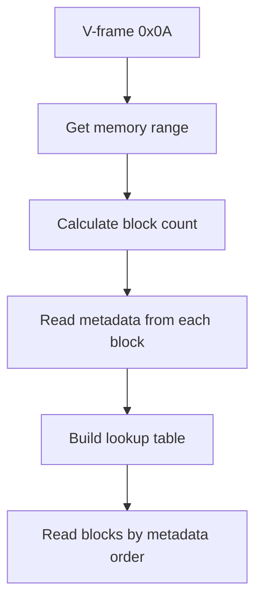

# DM-32UV Memory Layout

Complete memory map and addressing guide for the DM-32UV radio.

## Memory Organization

The DM-32UV uses a **16MB address space** with data organized in **4KB blocks**.

```
┌─────────────────────────────────────────────────────────┐
│                 16MB Address Space                      │
│                  (0x000000 - 0xFFFFFF)                  │
├─────────────────────────────────────────────────────────┤
│  Low Memory     (0x000000 - 0x000FFF)   4 KB           │
│  System config                                          │
├─────────────────────────────────────────────────────────┤
│  Main Config    (0x001000 - 0x0C8FFF)   800 KB         │
│  CRITICAL: Channels, zones, messages, RX groups         │
│  Discovered via V-frame 0x0A                           │
├─────────────────────────────────────────────────────────┤
│  Unknown/Reserved (0x180000 - 0x200FFF)   512 KB       │
│  Purpose unknown - no V-frame points to this range      │
├─────────────────────────────────────────────────────────┤
│  DMR Contacts   (0x278000 - 0xFFFFFF)   4-13 MB        │
│  Contact database, size varies by firmware              │
│  Discovered via V-frame 0x0F                           │
└─────────────────────────────────────────────────────────┘
```

## Main Config Block (0x001000 - 0x0C8FFF)

**Discovery Method**: V-frame 0x0A returns memory range

**Size**: 800 KB (819,200 bytes)  
**Blocks**: 200 × 4KB blocks  
**Organization**: Metadata-driven (see Metadata System below)

## Metadata System

### How It Works

The radio uses **dynamic memory allocation**. Block types are identified by a **metadata byte** stored at the last byte of each 4KB block (offset +0xFFF).

**Visual Representation of a 4KB Block:**
```
┌─────────────────────────────────────────────────────────┐
│                    4KB Block (0x1000 bytes)             │
├─────────────────────────────────────────────────────────┤
│ Offset 0x000: Block Data Start                         │
│               ↓                                         │
│               [Data content varies by block type]       │
│               ↓                                         │
│               ...                                       │
│               ↓                                         │
│ Offset 0xFFE: Last data byte                           │
├─────────────────────────────────────────────────────────┤
│ Offset 0xFFF: Metadata Byte ← Identifies block type    │
└─────────────────────────────────────────────────────────┘

Example: Channel Block
  Metadata = 0x12 (first channel block)
  Metadata = 0x13 (second channel block)
  ...
  Metadata = 0x41 (last channel block)
```

**NOTE**: The OEM CPS software reads metadata at offset `0x00A` (10 bytes) instead of `0xFFF`. This has been observed in serial captures (e.g., `0xFFAF0A` reading metadata `0x12` from block `0xFFA000`). However, full block reads confirm metadata is also present at offset `0xFFF`. Both locations may contain the same value, or the OEM CPS may use a different discovery method.

### Metadata Discovery Process



**Algorithm**:
1. Query V-frame 0x0A to get start/end addresses
2. Calculate number of 4KB blocks: `(end - start) / 0x1000`
3. For each block, read metadata byte at `address + 0xFFF`
4. Build lookup table mapping metadata values to addresses
5. Read blocks in metadata order (not address order)

### Metadata Values Reference

**⚠️ CRITICAL**: All block addresses are **dynamically allocated** and **vary between radios and firmware versions**. Block locations must be discovered by reading metadata bytes (offset `0xFFF`) from each 4KB block in the main config range. **Never hardcode addresses** - always use metadata discovery.

#### Complete Metadata Value List (Numerical Order)

All metadata values discovered from probe data, organized by value. All blocks are 4KB in size.

| Metadata | Hex | Dec | Purpose |
|----------|-----|-----|---------|
| **0x02** | 0x02 | 2 | **Frequency Adjustment/Calibration Data** |
| **0x03** | 0x03 | 3 | **Digital Emergency Systems** |
| **0x04** | 0x04 | 4 | **Embedded Information / Radio Names** |
| **0x05** | 0x05 | 5 | **Not Found / Unused** |
| **0x06** | 0x06 | 6 | **DTMF Encode Data** |
| **0x07** | 0x07 | 7 | **Configuration Header** |
| **0x08** | 0x08 | 8 | **Reserved** |
| **0x09** | 0x09 | 9 | **Reserved** |
| **0x0A** | 0x0A | 10 | **Quick Text Messages** |
| **0x0B** | 0x0B | 11 | **RX Group List** |
| **0x0C** | 0x0C | 12 | **Reserved** |
| **0x0D** | 0x0D | 13 | **Reserved** |
| **0x0E** | 0x0E | 14 | **Reserved** |
| **0x0F** | 0x0F | 15 | **TX Contact Assignment** |
| **0x10** | 0x10 | 16 | **Analog Emergency Systems** |
| **0x11** | 0x11 | 17 | **Scan Lists** |
| **0x12-0x41** | 0x12-0x41 | 18-65 | **Channel blocks 0-47** (48 blocks, supports ~4,080 channels) |
| **0x42** | 0x42 | 66 | **Reserved** |
| **0x43** | 0x43 | 67 | **Reserved** |
| **0x5A** | 0x5A | 90 | **Reserved** |
| **0x5c** | 0x5c | 92 | **Zones** |
| **0x65** | 0x65 | 101 | **Roaming Zones** |
| **0x66** | 0x66 | 102 | **Roaming Channels** |
| **0x67** | 0x67 | 103 | **DMR Radio ID List** |
| **0x6A** | 0x6A | 106 | **Reserved** |
| **0x6C** | 0x6C | 108 | **Reserved** |
| **0x6D** | 0x6D | 109 | **Reserved** |
| **0x75** | 0x75 | 117 | **Reserved** |

#### Channel Blocks (Sequential)

| Metadata | Hex | Dec | Block# | Channels |
|----------|-----|-----|--------|----------|
| 0x12 | 0x12 | 18 | 0 | 1-85 |
| 0x13 | 0x13 | 19 | 1 | 86-170 |
| 0x14 | 0x14 | 20 | 2 | 171-255 |
| ... | ... | ... | ... | ... |
| 0x41 | 0x41 | 65 | 47 | 3916-4000 |

**Pattern**: Metadata increments from 0x12 to 0x41 (48 blocks total)

**Channel Capacity**: 48 blocks × ~85 channels/block = ~4,080 channels (radio spec: 4,000 max)

#### Special Values

| Metadata | Hex | Meaning | Frequency |
|----------|-----|---------|-----------|
| 0x00 | 0x00 | Empty block | ~52% |
| 0xFF | 0xFF | Invalid/unavailable | ~18.5% |

#### Important Notes on Metadata Values

**⚠️ CRITICAL**: Block addresses shown in the tables above are **examples only** and **vary between radios and firmware versions**. The radio uses dynamic memory allocation within the main config block (0x001000-0x0C8FFF). Always use metadata discovery rather than hardcoded addresses.

**Key Metadata Discoveries** (based on actual radio analysis and CPS code reverse engineering):

- **0x02 - Frequency Adjustment/Calibration Data**: Radio calibration settings
- **0x03 - Digital Emergency Systems**: DMR emergency system configurations
- **0x04 - Embedded Information / Radio Names**: Radio identification and embedded data
- **0x06 - DTMF Encode Data**: DTMF encoding configuration
- **0x0A - Quick Text Messages**: Canned/predefined text messages
- **0x0B - RX Group List**: DMR receive group lists (talk groups)
- **0x0F - TX Contact Assignment**: DMR transmit contact assignments
- **0x10 - Analog Emergency Systems**: Analog emergency system configurations
- **0x11 - Scan Lists**: Scan list definitions (92 bytes per list)
  - Layout: Lists 1-44 start at offset 16, lists 45+ start at offset 0
- **0x5c - Zones**: Zone definitions (57 bytes per zone)
  - Capacity: Up to ~71 zones per 4KB block (4096 / 57)
- **0x65 - Roaming Zones**: DMR roaming zone configurations
- **0x66 - Roaming Channels**: DMR roaming channel configurations
- **0x67 - DMR Radio ID List**: DMR radio ID database

**Discovery Method**: 
1. Read all blocks in the main config range (via V-frame 0x0A)
2. Read metadata byte at offset `0xFFF` for each block
3. Search block contents for known data patterns (zone names, scan list names, etc.)
4. Build mapping of metadata values to actual block types

**For detailed byte-level parsing of each metadata block type, see [05-DATA-STRUCTURES.md](05-DATA-STRUCTURES.md).**

### Metadata Read Command

**⭐ Recommended Method (offset 0xFFF)**:
- Read 1 byte at `block_address + 0xFFF` (last byte of 4KB block)
- Address must be 4KB-aligned (0x001000, 0x002000, etc.)
- Fast and efficient - only reads 1 byte per block
- Example: `52 FF 1F 00 01 00` reads metadata from block 0x001000

**Alternative Method (offset 0x00A)**:
- OEM CPS software reads metadata at offset 0x00A (10 bytes from block start)
- Both locations contain the same metadata value
- Less efficient but may be useful for verification

**Why offset 0xFFF is recommended:**
- Consistent across all observed firmware versions
- Requires minimal data transfer (1 byte vs full block)
- Clear semantic meaning (last byte = block type marker)

## Channel Bank Discovery

**CRITICAL**: The channel bank address **varies between radios/firmware**.

**Why addresses vary:**
- The radio uses dynamic memory allocation within the main config block (0x001000-0x0C8FFF)
- Different firmware versions may allocate blocks in different orders
- User configuration (number of zones, contacts, etc.) affects block placement
- **Never hardcode channel addresses** - always use metadata discovery

### Known Channel Bank Addresses

These addresses are for reference only - **do not hardcode them**:

| Radio/Firmware | First Channel Address | Source |
|----------------|----------------------|--------|
| Factory/DMRVA/GBF | 0x00A00A | dm32_reference captures |
| EricPlug | 0x00200C | Eric's radio |
| Eric_1012 | 0x00E008 | Eric's radio (2025) |
| St Pete ANSI | 0x008006 | St Pete capture |
| L01 Firmware | 0x070000 | Memory scan 2025-01-20 |

### Channel Block Structure

**First Channel Block (metadata 0x12)**:
- **Header (16 bytes at offset 0x00-0x0F)**:
  - Bytes 0-3: Total channel count (little-endian uint32)
  - Bytes 4-15: Reserved (all zeros)
- **Channel Records**: Start at offset 0x10 (16 bytes)
- **Size**: 48 bytes per channel

**Subsequent Channel Blocks (metadata 0x13-0x41)**:
- **No header**: Channels start at offset 0x00
- **Size**: 48 bytes per channel

**Channel Record Layout**: See [05-DATA-STRUCTURES.md](05-DATA-STRUCTURES.md)

### Channel Discovery Algorithm

**Recommended Approach**: Use metadata discovery (see Metadata System above)

1. Query V-frame 0x0A to get main config block range
2. Scan all blocks in range, read metadata byte at offset 0xFFF
3. Find blocks with metadata 0x12-0x41 (channel blocks)
4. Read first block (metadata 0x12) to get channel count from header
5. Parse channels starting at offset 0x10 in first block, 0x00 in subsequent blocks

**Channel Count**:
- Location: First 4 bytes of first channel block (metadata 0x12)
- Format: Little-endian uint32
- Range: 1-4000 (actual count may be less)

**Channel Parsing**:
- First block (0x12): Start at offset 0x10, read header count
- Subsequent blocks (0x13-0x41): Start at offset 0x00
- Stop when header count is reached (channels are 1-indexed)

## Memory Regions by V-Frame

All memory pointer V-frames (0x06, 0x07, 0x08, 0x09, 0x0A, 0x0E, 0x0F) return 8 bytes:
- Bytes 0-3: Start address (little-endian uint32)
- Bytes 4-7: End address (little-endian uint32)

### V-Frame 0x06 - Audio Resource Index

```
Start:          0x001020
End:            0x00264FFF
Size:           2,490,880 bytes (~2.4 MB)
Record Size:    38 bytes
Max Records:    ~65,549
Purpose:        Audio resource index
```

### V-Frame 0x07 - Compact Item Table

```
Start:          0x000C9000
End:            0x00149FFF
Size:           540,672 bytes (~528 KB)
Record Size:    20 bytes
Max Records:    ~27,033
Purpose:        Compact item table
```

### V-Frame 0x08 - Zones

```
Start:          0x00001800
End:            0x00200FFF
Size:           2,097,152 bytes (2 MB)
Record Size:    32 bytes or variable
Max Records:    Variable
Purpose:        Zone definitions
```

### V-Frame 0x09 - Emergency/Recording

```
Start:          0x00006DC0 (varies, may be 0x00000000 if disabled)
End:            0x00FFFFFF (0xFFFFFF indicates disabled)
Size:           64 KiB (when enabled)
Record Size:    255 bytes
Purpose:        Emergency blob / audio recording
Note:           Disabled in L01 firmware (returns all zeros)
```

### V-Frame 0x0A - Main Config Block (CRITICAL)

```
Start:          0x001000
End:            0x0C8FFF
Size:           819,200 bytes (800 KB)
Blocks:         200 × 4KB
Purpose:        Channels, zones, scan lists, messages, RX groups
Discovery:      Metadata search required
```

### V-Frame 0x0E - Memberships/Lists

```
Start:          0x00001500
End:            0x00175FFF
Size:           1,507,328 bytes (~1.4 MB)
Record Size:    23 bytes
Max Records:    ~65,536
Purpose:        Memberships and lists
```

### V-Frame 0x0F - Contacts/Talkgroups

```
Start:          0x00002780
End:            0x006DBFFF (varies by firmware, may be 0x00FFFFFF)
Size:           7,176,192 bytes (~6.8 MB) or up to 16 MB
Record Size:    109 bytes
Max Records:    ~65,836 (standard) or more (extended firmware)
Purpose:        DMR contacts and talkgroups
Note:           End address varies significantly between firmware versions
```

## Addressing Rules

### Address Alignment
- **All addresses must be 4KB-aligned** for block operations
- Valid addresses: 0x000000, 0x001000, 0x002000, etc.
- Invalid: 0x000500, 0x001234, etc.

### Byte Order
- **Read command addresses**: **Little-endian** (LSB first)
- **Write command addresses**: Little-endian
- **Multi-byte data values**: Little-endian
- **Length fields**: Little-endian
