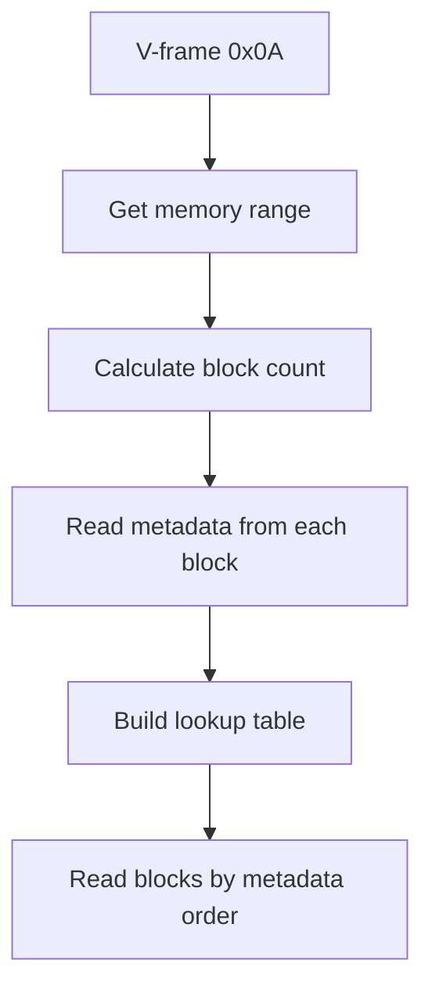

# DM-32UV Memory Layout

Complete memory map and addressing guide for the DM-32UV radio.

This document owns the **map and the mechanism**: the address space, the V-frame region pointers, how
the metadata/logical-ID system works, and the addressing rules.

> **The exhaustive per-block census lives in [07-BLOCK-INVENTORY.md](07-BLOCK-INVENTORY.md).**
> That document enumerates every byte value `0x00`-`0xFF`, states how many pages carry it, its
> measured entry stride, its confidence status, and whether the reference implementation handles it.
> This document keeps only a summary table and links out. If the two ever disagree,
> **07-BLOCK-INVENTORY.md wins** — it is generated directly from the hardware captures.

For byte-level record layouts see [05-DATA-STRUCTURES.md](05-DATA-STRUCTURES.md).

**Implementation reference**: `src/radios/dm32uv/memory.ts`, `src/radios/dm32uv/constants.ts`,
`src/radios/dm32uv/protocol.ts` (repository: [neonplug](https://neonplug.app))

## Confidence markers used in this document

| Marker | Meaning |
|--------|---------|
| *(no marker)* | **CONFIRMED** — observed on real hardware, or implemented and exercised against a real radio |
| `⚠️ DERIVED` | Implemented or inferred, but never verified against hardware |
| `❓ UNKNOWN` | Purpose not established |

Two OEM-CPS serial captures against a real radio (DP570UV, a DM-32UV rebadge, firmware
`DM32.01.01.046`, DMR CPS V1.41) are the top authority for this document:
[`serial_capture_example.txt`](serial_capture_example.txt) (full read) and
[`serial_capture_write_example.txt`](serial_capture_write_example.txt) (full write). Where those
captures disagree with the reference implementation or with an earlier revision of this spec, the
captures win, and the override is called out inline.

> ⚠️ **Sample bias**: the captured radio was at factory defaults (25 channels, 1 zone, 2 scan lists,
> 5 quick messages, 5 DMR radio IDs, 8 talk groups, 3 roam zones). Allocation *counts* from it are a
> lower bound, not the steady state. Entry *strides* and the *logical-ID space* are fully proven by
> it, because the OEM CPS write pass walks every slot it knows about whether or not it is populated.

## Memory Organization

The DM-32UV uses a **16MB address space** with data organized in **4KB blocks**.

Every region below was decoded from the memory-pointer V-frames in the read capture. See
[Memory Regions by V-Frame](#memory-regions-by-v-frame) for the raw payloads.

```
┌─────────────────────────────────────────────────────────┐
│                 16MB Address Space                      │
│                  (0x000000 - 0xFFFFFF)                  │
├─────────────────────────────────────────────────────────┤
│  Low Memory     (0x000000 - 0x000FFF)   4 KB           │
│  ❓ UNKNOWN - no V-frame points here                     │
├─────────────────────────────────────────────────────────┤
│  Main Config    (0x001000 - 0x0C8FFF)   800 KiB        │
│  CRITICAL: Channels, zones, messages, RX groups         │
│  V-frame 0x0A  -  200 x 4 KB metadata pages             │
├─────────────────────────────────────────────────────────┤
│  V-frame 0x07   (0x0C9000 - 0x149FFF)   516 KiB        │
│  ❓ UNKNOWN purpose - never accessed in any capture      │
├─────────────────────────────────────────────────────────┤
│  Boot image     (0x150000 - 0x175FFF)   152 KiB        │
│  V-frame 0x0E  -  240x320 BGR565 startup image          │
├─────────────────────────────────────────────────────────┤
│  V-frame 0x08   (0x180000 - 0x200FFF)   516 KiB        │
│  ❓ UNKNOWN purpose  (a V-frame DOES point here)         │
├─────────────────────────────────────────────────────────┤
│  V-frame 0x06   (0x201000 - 0x264FFF)   400 KiB        │
│  ❓ UNKNOWN purpose                                      │
├─────────────────────────────────────────────────────────┤
│  DMR Contacts   (0x278000 - 0x6DBFFF)   ~4.4 MiB       │
│  Contact database, size varies by firmware              │
│  V-frame 0x0F  -  92-byte records                       │
├─────────────────────────────────────────────────────────┤
│  V-frame 0x09   (0x6DC000 - 0xFFFFFF)   ~9.1 MiB       │
│  ❓ UNKNOWN purpose - tail of the address space          │
└─────────────────────────────────────────────────────────┘
```

> (*Previously documented: "`0x180000-0x200FFF` — no V-frame points to this range" — incorrect,
> V-frame `0x08` returns exactly that range; and "DMR Contacts `0x278000-0xFFFFFF`, 4-13 MB" —
> incorrect, the contacts region ends at `0x6DBFFF` and `0x6DC000-0xFFFFFF` is the separate
> V-frame `0x09` region.*)

Four gaps have no V-frame pointing at them at all — `0x000000-0x000FFF`, `0x14A000-0x14FFFF`,
`0x176000-0x17FFFF` and `0x265000-0x277FFF`. All `❓ UNKNOWN`.

The first 4 KB (`0x000000-0x000FFF`) was previously labelled "System config". `❓ UNKNOWN` — no
V-frame points at it, neither capture reads or writes it, and no implementation touches it. The
label may well be right; there is simply no evidence for it.

## Main Config Block (0x001000 - 0x0C8FFF)

**Discovery Method**: V-frame 0x0A returns memory range

**Size**: 800 KiB (819,200 bytes)  
**Pages**: 200 × 4 KB  
**Organization**: logical-ID driven (see Metadata System below)

**Page census on the captured factory radio**: 71 pages carry a live logical ID, 15 are tagged
`0x00`, 114 are tagged `0xFF`. Of the 71 live pages, **40 are read and/or written by the OEM CPS —
that is the codeplug — and 31 are allocated but never touched by anything.** Those 31 are the real
unknowns. Full breakdown in
[07-BLOCK-INVENTORY.md §C](07-BLOCK-INVENTORY.md#c-scoreboard).

## Metadata System

### How It Works

The radio uses **dynamic memory allocation**. Each 4 KB page carries a **metadata byte** at its last
byte (offset `+0xFFF`).

**That byte is a LOGICAL BLOCK ID, not a block "type".**

In the read capture all 200 pages were probed with a 1-byte read at `+0xFFF`, and **every non-empty
value occurs exactly once — there are no duplicates**. The write capture is conclusive: the OEM CPS
walks the ID space in strictly ascending order and emits a 4 KB write for *every* slot it knows
about, including slots that have no page on this radio, which it addresses with the sentinel
`0xFFF001`.

> The correct model is **one page per ID**: `0x12` is not "a channel block", it is **channel bank
> slot 1**; `0x13` is slot 2; and so on. (*Previously documented as "the metadata byte identifies
> the block type" — that misled readers into expecting duplicate values inside the channel range.*)
> See [07-BLOCK-INVENTORY.md §A.1](07-BLOCK-INVENTORY.md#a1-the-metadata-byte-is-a-logical-block-id-not-a-block-type).

**Visual Representation of a 4KB Page:**
```
┌─────────────────────────────────────────────────────────┐
│                    4KB Page (0x1000 bytes)              │
├─────────────────────────────────────────────────────────┤
│ Offset 0x000: Payload start                            │
│               ↓                                         │
│               [Content determined by the logical ID]    │
│               ↓                                         │
│               ...                                       │
│               ↓                                         │
│ Offset 0xFFE: Last payload byte                        │
├─────────────────────────────────────────────────────────┤
│ Offset 0xFFF: LOGICAL BLOCK ID (the "metadata byte")   │
└─────────────────────────────────────────────────────────┘

Example: channel bank
  ID = 0x12 (channel bank slot 1)   ─┐
  ID = 0x13 (channel bank slot 2)    │  48 contiguous slots,
  ...                                │  each on its own page
  ID = 0x41 (channel bank slot 48)  ─┘
```

**Flash translation layer.** Because IDs are unique and their page addresses bear no relation to the
ID, address assignment behaves like an FTL: the radio picks whatever physical page it likes and
records the ID in it. `0xFFF001` is the "no physical page" sentinel address used by the OEM CPS when
it declares a slot that is not currently allocated. This is *why* addresses must never be hardcoded.

**Where the metadata byte is read.** At `+0xFFF` — the OEM CPS reads it there in all 200 probes.
(*An "alternative method at offset `0x00A`" was previously documented — incorrect; no such read
exists in either capture, and there is no second metadata location.*)

### Metadata Discovery Process


```mermaid
graph TD
    A[V-frame 0x0A] --> B[Get memory range]
    B --> C[Calculate block count]
    C --> D[Read metadata from each block]
    D --> E[Build lookup table]
    E --> F[Read blocks by metadata order]
```

**Algorithm**:
1. Query V-frame 0x0A to get start/end addresses
2. Align the end address down to a page boundary and count the pages:
   `alignedEnd = floor(end / 0x1000) * 0x1000`; `pages = floor((alignedEnd - start) / 0x1000) + 1`
   (for `0x001000-0x0C8FFF` this yields pages `0x001000`…`0x0C8000` inclusive = **200**)
3. For each page, read **1 byte** at `address + 0xFFF`
4. Build a lookup table mapping logical ID → address
5. Read pages in logical-ID order (not address order)

**Pacing**: the reference implementation sleeps **5 ms** between metadata reads
("*Small delay between metadata reads to avoid overwhelming the radio*"), on top of the
25 ms pre-read and 30 ms post-read settling delays in the wire layer — about 60 ms per page, so a
full 200-page scan takes roughly 12 seconds.

**Implementation reference**: `src/radios/dm32uv/memory.ts`

### Metadata Values Reference

**⚠️ CRITICAL**: All block addresses are **dynamically allocated** and **vary between radios and firmware versions**. Block locations must be discovered by reading metadata bytes (offset `0xFFF`) from each 4KB block in the main config range. **Never hardcode addresses** - always use metadata discovery.

#### Summary of Logical Block IDs

**This is a summary. The exhaustive, per-value inventory — including every value that has never been
observed, measured entry strides, and per-block implementation status — is
[07-BLOCK-INVENTORY.md §B](07-BLOCK-INVENTORY.md#b-complete-metadata-value-inventory). Do not
duplicate that table here.**

All pages are 4 KB. "Slots" means contiguous logical IDs forming one bank.

| ID / range | Dec | Purpose | Status |
|------------|-----|---------|--------|
| `0x01` | 1 | Allocated page, never touched by the CPS. Unrelated to V-frame `0x01` | `❓ UNKNOWN` |
| `0x02` | 2 | Frequency adjustment / calibration data | `⚠️ DERIVED` — name from the implementation only; no field ever decoded |
| `0x03` | 3 | **"Call" list** — entry array at `0x218`, stride `0x28`, UTF-16LE names (`"Call 1"`…`"Call 5"`). Read **and written** by the OEM CPS. Layout confirmed; purpose not | `❓ UNKNOWN` (purpose only; previously documented as Digital Emergency Systems — incorrect; see the note below) |
| `0x04` | 4 | Radio Settings / Radio Names / Embedded Information | CONFIRMED (≈85 of 4096 bytes mapped) |
| `0x05` | 5 | Allocated page, never touched by the CPS | `❓ UNKNOWN` (previously documented as "Not Found / Unused" — incorrect, the page exists) |
| `0x06` | 6 | Multi-section analog config: DTMF code table @`0x000` (stride 16); analog contact names @`0x200` (stride 32); a second `"BDC"` table @`0xAA0`; count byte @`0x1FF` (`⚠️ DERIVED` — **not** the talk-group counter, see below) | CONFIRMED (previously documented as "DTMF Encode Data" only — incomplete) |
| `0x07` | 7 | Labelled `// 0x07 - Config header` in one implementation comment, in a list of *"known but unhandled metadata values"*; no code acts on it and the CPS never reads or writes it | `❓ UNKNOWN` |
| `0x08`, `0x09` | 8, 9 | Allocated pages, never touched | `❓ UNKNOWN` (previously "Reserved" — retired, see below) |
| `0x0A` | 10 | Quick text messages — 129-byte (`0x81`) entries | CONFIRMED |
| `0x0B` | 11 | **Quick Access Contact List** — contact counts, 128-slot usage bitmask, two contact index tables | CONFIRMED (previously "RX Group List", then "Unknown" — both understate what is known) |
| `0x0C`, `0x0D`, `0x0E` | 12-14 | Allocated pages, never touched. Unrelated to V-frame `0x0E` | `❓ UNKNOWN` (previously "Reserved" — retired) |
| `0x0F` | 15 | RX Group List (DMR receive groups) — 109-byte (`0x6D`) entries. **Not** the same namespace as V-frame `0x0F` | CONFIRMED |
| `0x10` | 16 | Multi-section: Digital Emergency @`0x000` / Analog Emergency @`0x0AC` / Encryption keys @`0x300` | CONFIRMED (layout); both emergency parsers in the reference implementation are stubs |
| `0x11` | 17 | Scan lists — 57-byte (`0x39`) entries | CONFIRMED |
| `0x12`-`0x41` | 18-65 | **Channel bank slots 1-48** — 48-byte records. `0x41` additionally carries the VFO A/B records | CONFIRMED — the write capture walks all 48 slots contiguously |
| `0x42` | 66 | TX Contact index, low channels — 2 bytes per channel from `0x000` | Stride and base CONFIRMED; the channel at which it hands over to `0x43` is `⚠️ DERIVED` (see below) |
| `0x43` | 67 | TX Contact index, high channels **and** VFO A (`0x0FFA`) / VFO B (`0x0FFC`) | VFO offsets CONFIRMED (write capture: `0FFA = 0E 01`, `0FFC = 0E 01`, `0FFF = 43`); channel handover `⚠️ DERIVED` |
| `0x44`-`0x48` | 68-72 | **Talk group bank slots 1-5** — 24-byte entries (entry 1 is 25 bytes: leading header byte) | CONFIRMED — the write capture walks all 5 slots contiguously |
| `0x4B`, `0x4F`, `0x50`-`0x5B` | 75, 79, 80-91 | Allocated pages, never touched. `0x50`-`0x5B` is 12 consecutive IDs — the largest unexplained region | `❓ UNKNOWN` (`0x5A` previously "Reserved" — retired) |
| `0x5C`-`0x64` | 92-100 | **Zone bank slots 1-9** — 145-byte (`0x91`) entries, 16-byte page header (byte `0x00` = zone count, `⚠️ DERIVED`) | CONFIRMED — see the zone-range note below |
| `0x65` | 101 | Roaming zones — 33-byte (`0x21`) entries, 16-byte header | CONFIRMED (stride); not implemented in the reference implementation |
| `0x66` | 102 | Roaming channels — 26-byte (`0x1A`) entries from `0x000` | CONFIRMED (stride); not implemented |
| `0x67` | 103 | DMR Radio ID list — 16-byte (`0x10`) entries | CONFIRMED |
| `0x69`-`0x6E`, `0x74`, `0x75`, `0x7C` | 105-110, 116, 117, 124 | Allocated pages, never touched | `❓ UNKNOWN` (`0x6A`, `0x6C`, `0x6D`, `0x75` previously "Reserved" — retired) |
| everything else | — | Not allocated on the captured radio, not declared by the OEM CPS write walk, and not named in any implementation. Concretely: `0x15`-`0x17`, `0x19`, `0x1B`, `0x1E`, `0x21`, `0x24`-`0x2F`, `0x33`, `0x35`, `0x36`, `0x38`-`0x3A`, `0x3C`, `0x3E`-`0x40`, `0x45`-`0x48` and `0x61`-`0x63` **are** declared by the write walk but had no page on this radio (unallocated capacity slots, covered by the range rows above); everything outside the ranges above is genuinely unobserved | never observed |

##### "Reserved" was invention — it is retired

Ten IDs were previously listed in this document as **Reserved**:
`0x08 0x09 0x0C 0x0D 0x0E 0x5A 0x6A 0x6C 0x6D 0x75`. The captures show that **all ten pages exist and
are allocated** — they carry a live logical ID — but the OEM CPS never reads or writes any of them.
"Reserved" implies the manufacturer set them aside deliberately, which no evidence supports. Their
correct status is `❓ UNKNOWN` (allocated, purpose unestablished). Do not reintroduce the word
"Reserved" for a block without evidence that the radio actually reserves it. See
[07-BLOCK-INVENTORY.md §B.1](07-BLOCK-INVENTORY.md#b1-reserved-was-invention--it-is-retired).

##### Zone bank range: `0x5C`-`0x64`, not `0x5C` alone

The zone bank is **9 slots, `0x5C`-`0x64`** — hardware-CONFIRMED: the OEM CPS write capture walks
all nine contiguously (allocated slots to their pages, unallocated ones to the `0xFFF001`
sentinel). This retires the reference implementation's own *"unverified, pending hardware
confirmation"* caveat on its `ZONE_LAST` constant. Its main write path (`writeAllData()`) reads and
writes the full range. (*This document previously listed only `0x5C` as "Zones".*)

##### Channel bank capacity

| ID | Slot | Channels held |
|----|------|---------------|
| `0x12` | 1 | 1-84 |
| `0x13` | 2 | 85-169 |
| `0x14` | 3 | 170-254 |
| … | … | … |
| `0x41` | 48 | 3995-4079 |

**Slot 1 holds 84 channels, not 85**, because a 16-byte header occupies `0x000-0x00F` and records
start at `0x010`. An 85th record would need `0x010 + 85 × 48 = 0x1000` bytes — one byte past the end
of the page, colliding with the logical-ID byte at `0xFFF`. So slot 1 stops at 84: the last record
starts at `0x010 + 83 × 48 = 0xFA0` and ends at `0xFCF`. Slots 2-48 have no header and hold 85
records each (`85 × 48 = 0xFF0`; the last record starts at `0xFC0` and ends at `0xFEF`, leaving
`0xFF0-0xFFF` free for the ID byte).

**Capacity**: `84 + 47 × 85 = 4,079` channels across 48 slots — comfortably above the radio's
advertised 4,000-channel maximum.

**The 84 boundary is hardware-confirmed, not just an implementation convention.** The OEM CPS write
capture programs a 128-channel codeplug and splits it **84 records into slot `0x12` + 44 records
into slot `0x13`**. If slot 1 held 85 the split would have been 85 + 43.

> **Previously documented as**: slot 1 = channels 1-85, slot 2 = 86-170, capacity
> "48 blocks × ~85 = ~4,080". The per-slot boundaries were off by one from slot 2 onwards. The
> reference implementation also uses 84 for the first block and 85 thereafter
> (`src/radios/dm32uv/protocol.ts`), which agrees with the capture.

Note that the channel *count* stored in slot 1 governs how many slots are actually populated; the
48-slot span is capacity, not occupancy. On the captured factory radio (25 channels) only slot 1 held
channel data, yet 19 pages in the `0x12`-`0x41` range were allocated — the relationship between
channel count and allocated slots is `❓ UNKNOWN`.

##### TX Contact index split: where `0x42` hands over to `0x43`

Both pages hold a flat array of 2-byte TX-contact entries from offset `0x000`, one per channel in
order. **The channel number at which the array continues into `0x43` is `⚠️ DERIVED` and the
reference implementation contradicts itself about it:**

- `constants.ts` declares `LOW_BLOCK_CHANNELS: 2048` and `HIGH_BLOCK_START: 2049`.
- `blockLayouts.ts` declares both pages as `repeat: { count: 2047, stride: 2 }`, and labels `0x43`
  as *"channel 2047+N"*.

Page arithmetic favours the smaller figure: 2,048 entries would occupy `0x000-0xFFF` exactly,
and the last of them would land on `0x0FFE-0x0FFF` — colliding with the logical-ID byte at `0x0FFF`.
On `0x43` it would also collide with VFO B at `0x0FFC`. Neither capture exercises a codeplug large
enough to cross the boundary (the write capture has 128 channels), so it remains unverified.

#### Special Values — page tags, not logical IDs

`0x00` and `0xFF` are the only two byte values that appear on more than one page. They are **page
tags**, not logical IDs. Counts below are from the 200-page read capture of a factory-default radio.

| Tag | Count | Share | Distribution | Interpretation |
|-----|-------|-------|--------------|----------------|
| `0x00` | 15 | 7.5% | 13 of 15 lie in the low third, interleaved with live pages | `⚠️ DERIVED` — allocated then invalidated (superseded copy) |
| `0xFF` | 114 | 57.0% | confined to the upper region, but **not contiguous** — 22 separate runs | `⚠️ DERIVED` — erased / never-allocated free page |
| live logical IDs | 71 | 35.5% | 40 in the low third, 31 above it | the codeplug plus 31 untouched pages |

Arithmetic check: `71 + 15 + 114 = 200`. ✔

The split point is sharp: pages `0x001000`-`0x035000` (the first 53) contain **no `0xFF` at all** —
they are 40 live IDs plus 13 `0x00`. Pages `0x036000`-`0x0C8000` (the remaining 147) are 114 `0xFF`,
31 live IDs and 2 `0x00`, with the `0xFF` pages broken into 22 runs by the live pages between them.

> **Previously documented as**: `0xFF` occupying "one contiguous high region". **Incorrect** — it is
> 22 runs. The high region is where the free pages are, but they are not one block, and 31 live
> pages sit inside it.

The reference implementation treats both tags identically as `'empty'`. The invalidated-vs-erased
reading is an inference from the distribution, not a measurement — worth one experiment to confirm
(see [07-BLOCK-INVENTORY.md § C.4](07-BLOCK-INVENTORY.md)). The 31 live IDs in the upper region are
**not** the same set as the 31 CPS-untouched IDs; the counts coinciding is a coincidence.
(*Previously documented as `0x00` = "Empty, ~52%" and `0xFF` = "Invalid, ~18.5%" — both figures
were roughly inverted relative to the capture.*)

#### Important Notes on Metadata Values

**⚠️ CRITICAL**: Any page address quoted anywhere in this document or in
[07-BLOCK-INVENTORY.md](07-BLOCK-INVENTORY.md) is an **example only** and **varies between radios,
between firmware versions, and on the same radio after any codeplug edit**. Always resolve
addresses by scanning logical IDs; never hardcode them.

**Byte-level layouts for every block type — entry strides, field tables, worked hex examples —
live in [05-DATA-STRUCTURES.md](05-DATA-STRUCTURES.md). The per-ID census and open-questions list
live in [07-BLOCK-INVENTORY.md](07-BLOCK-INVENTORY.md).** This document deliberately stops at the
summary table above.

### Metadata Read Command

**The only known method (offset 0xFFF)**:
- Read 1 byte at `page_address + 0xFFF` (last byte of the 4KB page)
- The **page base** must be 4KB-aligned (0x001000, 0x002000, …); the read address itself ends in
  `0xFFF` and is therefore *not* aligned — that is expected and correct
- Fast and efficient — only 1 byte per page
- Wire form: `52 <page+0xFFF:3 LE> 01 00` → `57 <addr:3 LE> 01 00 <byte>`
- Example: `52 FF 1F 00 01 00` reads the logical ID of the page at `0x001000`

> (*An "alternative method at offset `0x00A`" was previously documented — unsupported; there is no
> second metadata location.*)

**On write**, the logical ID is **inside** the 4096-byte payload at `data[0xFFF]`, not appended to
the frame. See [03-COMMANDS.md](03-COMMANDS.md).

**Implementation reference**: `src/radios/dm32uv/memory.ts`, `src/radios/dm32uv/connection.ts`

## Channel Bank Discovery

**CRITICAL**: The channel bank address **varies between radios/firmware**.

**Why addresses vary:**
- The radio uses dynamic memory allocation within the main config block (0x001000-0x0C8FFF)
- Different firmware versions may allocate blocks in different orders
- User configuration (number of zones, contacts, etc.) affects block placement
- **Never hardcode channel addresses** - always use metadata discovery

### Known Channel Bank Addresses

**These are historical examples only, published so that readers can see how much placement varies.
They are NOT a lookup table and MUST NOT be hardcoded.** Each row is one radio at one moment; the
same radio will move the bank as soon as its codeplug is edited (see the flash-translation-layer note
above). Provenance for these five rows is community captures of varying age and none has been
re-verified against the current captures — treat the whole table as `⚠️ DERIVED`.

| Radio/Firmware | First Channel Address | Source |
|----------------|----------------------|--------|
| Factory/DMRVA/GBF | 0x00A00A | dm32_reference captures |
| EricPlug | 0x00200C | Eric's radio |
| Eric_1012 | 0x00E008 | Eric's radio (2025) |
| St Pete ANSI | 0x008006 | St Pete capture |
| L01 Firmware | 0x070000 | Memory scan 2025-01-20 |

For comparison, on the DP570UV read capture the `0x12` page sits at **`0x0AA000`** — a sixth
distinct value, which is the point.

Note that four of the five addresses above are not 4KB-aligned (`0x00A00A`, `0x00200C`, `0x00E008`,
`0x008006`). Page bases *are* 4KB-aligned, so these appear to be addresses of the first channel
*record* or of some other in-page offset rather than of the page itself. Their exact meaning is
`❓ UNKNOWN`.

### Channel Block Structure

**First channel bank slot (logical ID 0x12)**:
- **Header (16 bytes at offset 0x00-0x0F)**:
  - Bytes 0-1: Total channel count, **little-endian uint16**
  - Bytes 2-15: fill, **not part of the count** — `0x00` in the factory read capture, `0xFF` in the
    OEM CPS write capture. Purpose `❓ UNKNOWN` (see the field-width note below)
- **Channel Records**: Start at offset 0x10
- **Size**: 48 bytes per channel, 84 records (see the capacity note above)

**Subsequent channel bank slots (logical IDs 0x13-0x41)**:
- **No header**: Channels start at offset 0x00
- **Size**: 48 bytes per channel, 85 records

**Channel Record Layout**: See [05-DATA-STRUCTURES.md](05-DATA-STRUCTURES.md)

#### Channel count field width — 2 bytes, settled by the write capture

The channel count occupies **bytes 0-1 only**, as a little-endian uint16. Bytes 2-15 are fill and
must not be included.

| Capture | `0x12` page bytes `0x00-0x0F` | Channel count | Records actually present |
|---|---|---|---|
| Read (factory) | `19 00 00 00 00 00 00 00 00 00 00 00 00 00 00 00` | 25 | 25 in slot 1 |
| Write (user codeplug) | `80 00 ff ff ff ff ff ff ff ff ff ff ff ff ff ff` | 128 | 84 in slot 1 + 44 in slot 2 |

The write capture is decisive. Decoding four bytes there yields `0xFFFF0080` — 4,294,901,888
channels. Decoding two yields `0x0080` = 128, which is exactly the number of channel records the
same capture goes on to write. **The field is 16-bit; do not read four bytes.**
(*Previously documented as uint32 on the strength of the read capture alone, where bytes 2-3 are
zero by coincidence of that radio's `0x00` fill — incorrect.*) The reference implementation's
2-byte `readChannelCount()` is correct.

**Implementation reference**: `src/radios/dm32uv/memory.ts`, `src/radios/dm32uv/protocol.ts`

### Channel Discovery Algorithm

**Recommended Approach**: Use metadata discovery (see Metadata System above)

1. Query V-frame 0x0A to get main config block range
2. Scan all pages in range, read the logical ID at offset 0xFFF
3. Find pages with IDs `0x12`-`0x41` (channel bank slots) and sort them by ID, not by address
4. Read the `0x12` page's header to get the channel count
5. Parse channels starting at offset 0x10 in slot 1, 0x00 in subsequent slots

**Channel Count**:
- Location: bytes `0x00-0x01` of the `0x12` page
- Format: little-endian uint16 (**not** uint32 — see the field-width note above)
- Range: 1-4000 (actual count may be less)

**How many slots to read** (as implemented in `src/radios/dm32uv/protocol.ts`):

```
if (count <= 84)  slotsNeeded = 1
else              slotsNeeded = 1 + ceil((count - 84) / 85) + 1   // trailing +1 is "for safety"
slotsNeeded = min(slotsNeeded, discoveredChannelSlots.length)
```

The trailing `+1` is a deliberate over-read (verbatim comment: *"+1 for safety"*), not part of the
format.

**Channel Parsing**:
- Slot 1 (`0x12`): start at offset 0x10; last record starts at `0x010 + 83 * 48 = 0xFA0`
- Subsequent slots (`0x13`-`0x41`): start at offset 0x00; last record starts at `84 * 48 = 0xFC0`
- Stop when the header count is reached (channels are 1-indexed)
- A record whose every byte is either `0x00` or `0xFF` is treated as empty and skipped, but **still
  consumes a channel index** — holes in the bank do not renumber the channels after them. (Note the
  test is per byte, so a record mixing `0x00` and `0xFF` fill also counts as empty; it is not
  "entirely `0xFF` **or** entirely `0x00`", as an earlier revision of this document said.)

## Memory Regions by V-Frame

Memory-pointer V-frames (0x06, 0x07, 0x08, 0x09, 0x0A, 0x0E, 0x0F) return 8 bytes:
- Bytes 0-3: Start address (little-endian uint32)
- Bytes 4-7: End address (little-endian uint32)

> ⚠️ *The start addresses for V-frames 0x06, 0x08, 0x09, 0x0E and 0x0F were previously published
> with a byte-shift decoding error (`00 00 18 00` transcribed as `0x001800` instead of `0x180000`),
> along with derived record-size and purpose claims that had no identified source. The values below
> are machine-decoded from the raw payloads, which are quoted so the decode can be checked.*

Summary — decoded from [`serial_capture_example.txt`](serial_capture_example.txt):

| V-frame | Raw payload | Range | Size | Purpose | Status |
|---------|-------------|-------|------|---------|--------|
| 0x06 | `00 10 20 00` / `ff 4f 26 00` | `0x201000-0x264FFF` | 409,600 B (400 KiB) | — | `❓ UNKNOWN` |
| 0x07 | `00 90 0c 00` / `ff 9f 14 00` | `0x0C9000-0x149FFF` | 528,384 B (516 KiB) | — | `❓ UNKNOWN` |
| 0x08 | `00 00 18 00` / `ff 0f 20 00` | `0x180000-0x200FFF` | 528,384 B (516 KiB) | — | `❓ UNKNOWN` |
| 0x09 | `00 c0 6d 00` / `ff ff ff 00` | `0x6DC000-0xFFFFFF` | 9,584,640 B (~9.1 MiB) | — | `❓ UNKNOWN` |
| 0x0A | `00 10 00 00` / `ff 8f 0c 00` | `0x001000-0x0C8FFF` | 819,200 B (800 KiB) | Main config, 200 × 4 KB pages | CONFIRMED |
| 0x0E | `00 00 15 00` / `ff 5f 17 00` | `0x150000-0x175FFF` | 155,648 B (152 KiB) | Boot / startup image | CONFIRMED |
| 0x0F | `00 80 27 00` / `ff bf 6d 00` | `0x278000-0x6DBFFF` | 4,603,904 B (~4.4 MiB) | DMR contact database | CONFIRMED |

### V-Frame 0x06 `❓ UNKNOWN`

```
Raw:            00 10 20 00 | ff 4f 26 00
Start:          0x201000
End:            0x264FFF
Size:           409,600 bytes (400 KiB)
Record Size:    UNKNOWN
Purpose:        UNKNOWN
```

(*Previously documented as start `0x001020`, "38-byte records", "Audio resource index" — the
address was a byte-shift mis-decode and the rest had no identified source.*) The frame is queried
by the reference implementation's V-frame sweep but never parsed or used.

### V-Frame 0x07 `❓ UNKNOWN`

```
Raw:            00 90 0c 00 | ff 9f 14 00
Start:          0x0C9000
End:            0x149FFF
Size:           528,384 bytes (516 KiB)
Record Size:    UNKNOWN
Purpose:        UNKNOWN
```

(*Previously documented with "20-byte records" and the label "Compact item table" — no identified
source.*) This range begins immediately after the main config region ends, which invites the guess
that it is a continuation area — a guess with no evidence.

### V-Frame 0x08 `❓ UNKNOWN`

```
Raw:            00 00 18 00 | ff 0f 20 00
Start:          0x180000
End:            0x200FFF
Size:           528,384 bytes (516 KiB)
Record Size:    UNKNOWN
Purpose:        UNKNOWN
```

(*Previously documented as "Zone definitions" — incorrect: zones live in the main config region as
logical IDs `0x5C`-`0x64`; the label originated from a commented-out, never-exercised line in the
reference implementation. Also previously described elsewhere as a region "no V-frame points to" —
V-frame `0x08` points at exactly this range.*)

### V-Frame 0x09 `❓ UNKNOWN`

```
Raw:            00 c0 6d 00 | ff ff ff 00
Start:          0x6DC000
End:            0xFFFFFF
Size:           9,584,640 bytes (~9.1 MiB)
Record Size:    UNKNOWN
Purpose:        UNKNOWN
```

(*Previously documented as "Emergency blob / audio recording, 255-byte records, 0xFFFFFF =
disabled" — no identified source; the end address `0xFFFFFF` is simply the top of the address
space.*) This region begins exactly where the contact database (V-frame 0x0F) ends, so on this
firmware the two partition the upper address space between them.

### V-Frame 0x0A - Main Config Block (CRITICAL)

```
Raw:            00 10 00 00 | ff 8f 0c 00
Start:          0x001000
End:            0x0C8FFF
Size:           819,200 bytes (800 KiB)
Pages:          200 × 4 KB
Purpose:        Channels, zones, scan lists, messages, RX groups, talk groups, settings
Discovery:      Logical-ID scan required (read 1 byte at each page + 0xFFF)
```

This is the only V-frame the reference implementation treats as mandatory: a missing or short reply
is a hard failure (*"Failed to get memory layout"*).

### V-Frame 0x0E - Boot / Startup Image

```
Raw:            00 00 15 00 | ff 5f 17 00
Start:          0x150000
End:            0x175FFF
Size:           155,648 bytes (152 KiB)
Payload:        153,600 bytes of raw BGR565 pixel data, 240 × 320 portrait, no header
Transfer:       37 full 4 KB reads + one 2,048-byte read = 38 transfers
```

> **Provenance**: the *range* above is from the capture (V-frame `0x0E` reply). The payload format
> and transfer scheme are **not** — neither capture touches `0x150000-0x175FFF` at all. They come
> from the reference implementation's boot-image feature, which is exercised against hardware
> (`src/utils/bootImage.ts`, `src/radios/dm32uv/protocol.ts`). The corroboration is that the
> implementation's hardcoded fallback base is `0x150000` and the radio returned exactly that.

> (*Previously documented as "Memberships and lists, 23-byte records" — a misnomer: RX groups are
> a logical block (`0x0F`) inside the main config region. The only exercised use of V-frame `0x0E`
> is as the boot-image base address.*)

### V-Frame 0x0F - DMR Contact Database

```
Raw:            00 80 27 00 | ff bf 6d 00
Start:          0x278000
End:            0x6DBFFF
Size:           4,603,904 bytes (~4.4 MiB)
Record Size:    92 bytes (0x5C)
Header:         16 bytes at the start address (4-byte LE count + 12 bytes padding)
Purpose:        DMR contact database
Note:           End address varies between firmware versions
```

> (*Previously documented with "109-byte records" — that is the RX-group entry size, copied into
> the contacts material by mistake. **A DMR contact record is 92 bytes.***)

The 16-byte header is hardware-confirmed. The very first frame of the write capture is a 4 KB write
to `0x278000` beginning:

```
0x000  01 00 00 00 ff ff ff ff ff ff ff ff ff ff ff ff   |................|
0x010  43 6f 6e 74 61 63 74 73 20 31 00 ff ff ff ff ff   |Contacts 1......|
```

— a 4-byte little-endian count of 1, twelve bytes of `0xFF` fill, then the first contact record at
`+0x10`. Note this page carries **no logical-ID byte**: `data[0xFFF]` is `0xFF` like the rest of the
fill. Logical IDs exist only inside the main config region (V-frame `0x0A`); the contact database is
addressed directly.

Arithmetic cross-check supporting the 92-byte record: V-frame `0x10` on the same radio returns
`0x00C350` = **50,000** as the maximum contact count. (The reply is **3 bytes**, `50 c3 00`, not 4 —
the reference implementation requires ≥4 and therefore silently falls back to its hardcoded default
of 50,000, which happens to be the same number.)

| Assumed record size | Capacity of the region | Matches 50,000? |
|---|---|---|
| 92 bytes, contiguous | `4,603,904 / 92 ≈ 50,042` | yes |
| 92 bytes, 44 per 4 KB page | `1,124 pages × 44 ≈ 49,456` | yes, within ~1% |
| 109 bytes | `≈ 42,238` | no |
| 16 bytes | `≈ 287,744` | no |

> ⚠️ Note an inconsistency in the reference implementation: its contact **capacity** helper divides
> the region by a `CONTACT_SIZE` of 16, while its contact **reader** uses 92. The capture supports
> 92. Treat the 16-byte figure as wrong.

**Contacts do not straddle page boundaries**: page 0 holds 44 records starting at
`start + 0x10`; every later 4 KB page holds 44 records starting at its own offset `0x000`
(`44 × 92 = 4,048`, leaving 48 bytes of slack per page).

### V-frames that are queried but carry no memory pointer

The V-frame sweep also queries `0x01`-`0x05`, `0x0B`, `0x0D` and `0x10`. Of those, `0x01` (firmware
version), `0x03` (build date), `0x04` (DSP version), `0x05` (radio version), `0x0B` (codeplug
version) and `0x10` (max contact count) are identified. `0x02` (12 bytes, two repeated `0xA415`
words) and `0x0D` (64 bytes, requested with an otherwise-undocumented `0x40` length byte) are
`❓ UNKNOWN`. `0x0C` is absent from the reference implementation's query list, which mirrors the OEM
capture — the OEM CPS does not query it either, and no reply from it has ever been observed. See
[03-COMMANDS.md](03-COMMANDS.md).

## Addressing Rules

### Address Alignment
- **Page bases are 4KB-aligned**: 0x000000, 0x001000, 0x002000, …
- **Full-page reads and writes must target an aligned base.** A write is always exactly
  `0x1000` bytes at an aligned address.
- **Byte-granular reads are NOT restricted to aligned addresses.** The logical-ID probe reads a
  single byte at `page + 0xFFF`, and the contact reader reads at arbitrary offsets. Both are normal
  and both appear throughout the captures.
- **`0xFFF001` is a sentinel, not a real address.** The OEM CPS both **reads 4 KB from it and
  writes 4 KB to it** to stand in for a logical slot that has no physical page — 36 such reads in
  the read capture and 36 such writes in the write capture, exactly matching the 36 undeclared
  slots. It is deliberately unaligned. Do not treat it as memory.
  (Previously described here as write-only; the read capture shows the same address on the read
  path.)

> **Previously documented as**: "All addresses must be 4KB-aligned for block operations… Invalid:
> 0x000500, 0x001234". Over-stated: the restriction applies to *page* operations, not to reads.

### Byte Order
- **Read command addresses**: **Little-endian** (LSB first), **3 bytes** — the address space is
  24-bit
- **Write command addresses**: little-endian, 3 bytes
- **Multi-byte data values**: little-endian (frequencies are BCD, see
  [06-ENCODING.md](06-ENCODING.md))
- **Length fields**: little-endian, 2 bytes
- **V-frame memory-pointer payloads**: two little-endian **uint32**s (start, end) — note the width
  difference from the 3-byte command addresses; this is the source of the byte-shift errors
  corrected above
